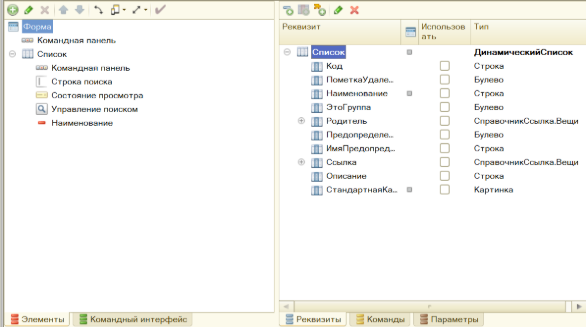
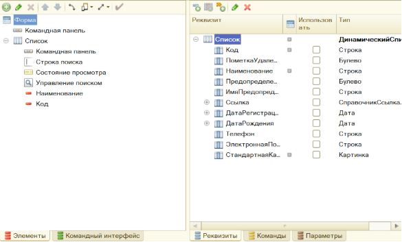

# Разработка мобильного приложения для службы перевозки вещей, с использованием мобильной платформы "1С: Предприятие 8"

# **Оглавление**
[Введение	4](#_toc186106818)

[1. Исследовательский раздел	5](#_toc186106819)

[1.1. Исследование предметной области	5](#_toc186106820)

[1.2 Типовые сценарии действий сотрудников	7](#_toc186106821)

[1.3. Схема бизнес-процессов	9](#_toc186106822)

[2. Аналитический раздел	11](#_toc186106823)

[2.1. Логическая структура базы данных	11](#_toc186106824)

[2.2. Проектирование мобильного приложения, карта переходов	17](#_toc186106825)

[2.3. Интерфейс мобильного приложения: проектирование	18](#_toc186106826)

[2.4. Функциональность мобильного приложения: проектирование	23](#_toc186106827)

[3. Технологический раздел	33](#_toc186106828)

[3.1. Реализация интерфейса мобильного приложения	33](#_toc186106829)

[3.2. Реализация функционала мобильного приложения	41](#_toc186106830)

[3.3. Тестирование	71](#_toc186106831)

[Заключение	90](#_toc186106832)

**

**Введение**

В условиях динамично развивающегося мира информационные технологии становятся ключевым инструментом для управления бизнесом, способствуя автоматизации процессов, повышению производительности и оперативности принятия решений. Одной из наиболее востребованных платформ для управления данными и бизнес-процессами в российских компаниях является «1С: Предприятие 8», предоставляющая широкий спектр функциональных возможностей.

Данная работа посвящена разработке мобильного приложения для сотрудников службы перевозки вещей с использованием мобильной платформы «1С: Предприятие 8». Организации, занимающиеся перевозкой грузов, ежедневно сталкиваются с необходимостью координации множества процессов: от принятия и обработки заказов до контроля выполнения доставки. Внедрение мобильных решений на базе «1С: Предприятие» позволяет значительно повысить оперативность и качество выполнения задач.

В ходе работы были исследованы возможности платформы для разработки мобильных приложений, спроектированы элементы системы, включая документы, справочники и обработчики событий, а также реализованы функции для автоматизации работы сотрудников службы перевозки. Особое внимание уделено созданию интуитивно понятного интерфейса и возможностей для формирования аналитических отчетов, необходимых для принятия управленческих решений.

Целью исследования является создание эффективного мобильного решения, способного не только повысить качество выполнения текущих операций, но и обеспечить потенциал для дальнейшего масштабирования и адаптации системы к изменяющимся условиям рынка.

**1. Исследовательский раздел**

**1.1. Исследование предметной области**

Служба перевозки вещей – это специализированная коммерческая организация, которая предоставляет услуги по перевозке различных грузов, предметов и вещей. Такие службы могут заниматься как междугородными, так и международными перевозками, а также осуществлять услуги по перевозке внутри города или региона.

Предприятия, специализирующиеся на перевозке вещей, ежедневно сталкиваются с вызовами, связанными с эффективным управлением логистическими операциями. В данной предметной области важнейшую роль играет точность выполнения заказов, минимизация времени ожидания клиентов и оптимизация маршрутов для снижения затрат. Современные потребители ожидают прозрачности в отслеживании заказов, своевременного взаимодействия и оперативного решения возникающих вопросов.

Актуальность разработки мобильного приложения для сотрудников службы перевозки вещей обусловлена следующими факторами:

- увеличение объемов работы: рост популярности услуг перевозки требует более слаженной работы между диспетчерами, водителями и складскими работниками;
- повышение требований клиентов: возможность отслеживания статуса заказа и оперативное решение вопросов становятся стандартом в индустрии;
- автоматизация рутинных задач: мобильное приложение позволяет значительно ускорить процессы регистрации заявок, назначения маршрутов и обработки данных о доставках;
- снижение операционных издержек: автоматизация процессов помогает минимизировать использование бумажных документов и сократить ошибки, связанные с человеческим фактором.

  Разработка приложения на платформе «1С: Предприятие 8» предоставляет дополнительные преимущества:

- единая система данных: мобильное приложение интегрируется с основной системой управления предприятием, обеспечивая синхронизацию и актуальность информации;
- гибкость в настройке: платформа позволяет адаптировать решение под специфику работы конкретной компании, например, поддерживать различные типы грузов и маршрутов;
- поддержка мобильных платформ: обеспечение работы на Android и iOS делает приложение доступным для большинства сотрудников.

  При разработке стратегии корпоративной мобильности важно учитывать как возможности, так и ограничения.

  Возможности:

- ускорение обработки заказов: сотрудники могут регистрировать заявки и формировать отчеты непосредственно в мобильном приложении;
- повышение производительности: автоматизация рутинных задач снижает временные затраты и вероятность ошибок;
- повышение прозрачности процессов: клиенты и руководство получают доступ к информации о текущем статусе доставки и сроках выполнения;

Ограничения:

- технические сложности: требуется обеспечение стабильного интернет-соединения и настройка надежной интеграции с основной системой.
- обучение персонала: не все сотрудники обладают навыками работы с мобильными устройствами, что требует внедрения программы обучения;
- сложность интеграции: корректное объединение мобильного приложения с другими модулями системы «1С: Предприятие» может потребовать дополнительных разработок и настройки.

  Внедрение мобильного приложения для сотрудников службы перевозки вещей представляет собой стратегический шаг для повышения конкурентоспособности предприятия. Оно позволяет не только улучшить качество предоставляемых услуг, но и создать основу для долгосрочного развития за счет оптимизации процессов и повышения эффективности управления.

  **1.2 Типовые сценарии действий сотрудников**

  Разработаем мобильное приложение, которое будет автоматизировать водителя службы перевозки вещей. Это приложение будет обмениваться данными с основным приложением, работающим на стационарном компьютере, то есть получать оттуда данные, изменять их и отсылать обратно.

  Сценарии работы офиса и водителей:

  1) Сначала в офисе создаются заказы клиентов (заявки на перевозку)\.

  2) Затем диспетчеры формируют маршруты и передают их водителям\.

  3) После выполнения водителями заказов обновляется информация о статусе перевозок\.

  4) По результатам работы водителей формируются отчеты о выполненных перевозках\.

  В офисном приложении реализуем следующие функции:

- При создании заявки менеджер вводит данные клиента, описание груза, дату и время перевозки, а также адреса отправки и доставки;
- В заявке фиксируется необходимость дополнительных услуг (например, упаковки груза или разгрузки).
- Список заявок отображается с условным оформлением в зависимости от их статуса.
- Для анализа работы службы перевозки строятся различные отчеты, включая статистику по выполненным заказам и расходам.
- Менеджер устанавливает цены упаковочного материала и цены оказываемых услуг на определенную дату, по которым они будут реализовываться. Эти цены хранятся в периодических регистрах сведений.
- При заполнении заказа могут вноситься услуги, товары и вещи, которые. Суммы по строкам табличной части автоматически подсчитываются.
- Менеджер сервисного центра создает заказ со статусом «Открыт», затем указывает водителя, который будет выполнять перевозку, и устанавливает статус заказа «В работе». После выполнения заказа менеджер проверяет заказ со статусом «Выполнен» и присваивает ему статус «Закрыт».
- Редактирование ранее созданных заказов возможно только в том случае, если заказ имеет статус «Открыт» или «В работе». Заказ со статусом «Выполнен» можно только закрыть, а заказ со статусом «Закрыт» можно только просматривать.
- Список заказов отображается с условным оформлением в зависимости от статуса заказа и его важности.
- В офисном приложении будет реализована работа с хранимыми файлами: выбор файла из локальной файловой системы, запись в справочник хранимых файлов, чтение файла из справочника и его открытие или запись в файловую систему пользователя. В основном справочник хранимых файлов используется для хранения и выбора картинок упаковочных материалов.
- На основе закрытых заказов создаются расходные накладные со списком использованных материалов и оказанных услуг. Все учитываются в разрезе клиентов и специалистов.
- Для анализа работы сервисного центра в офисе строятся различные отчеты.

Для мобильного приложения реализуем сценарии действий водителя:

- Водитель выполняет обмен данными с основной базой службы перевозки и получает список заказов на текущую смену. Затем забирает необходимые материалы со склада.
- Также специалист получает из сервисного центра список заказов в порядке их обслуживания.
- Открывает первый заказ, определяет местоположение клиента на карте.
- Звонит клиенту и сообщает о том, что он к нему едет. Возможно, он не дозванивается или задерживается, тогда специалист может послать клиенту SMS.
- Забирает груз, фотографирует его и отмечает статус заказа как «В работе».
- По прибытии к пункту назначения водитель связывается с получателем для уточнения деталей.
- Водитель может сделать фото- и видеосъемку, а также записать аудиосообщение о заказе.
- После этого водитель ставит отметку о выполнении заказа, и сразу же выполняется обмен с основной базой, чтобы в сервисный центр поступила оперативная информация.
- В случае необходимости водитель может создавать для себя напоминания (например, о звонке клиенту), которые будут появляться в указанное время или повторяться периодически. Кроме того, специалист может отправить клиенту письмо по электронной почте.
- Также водитель может получить отчет о своих заказах за период, используя те данные, которые есть на телефоне.
- Затем специалист находит следующий по порядку заказ в списке, открывает данные клиента, сделавшего заказ, и т. д.

  **1.3. Схема бизнес-процессов**

  Автоматизируемый бизнес-процесс начинается с формирования заявки клиентом, который создает запрос на перевозку. После поступления заявки менеджер обрабатывает ее, внося данные в базу и устанавливая цены на услуги. Далее менеджер согласовывает сроки перевозки, выбирает водителя и транспортное средство, после чего меняет статус заказа на «Открыт». Затем заказ передается водителю, который получает оповещение и необходимые данные для выполнения перевозки. Водитель прибывает на адрес загрузки, осуществляет загрузку груза и его доставку до места назначения, где производится выгрузка. После выполнения всех действий статус заказа меняется на «Выполнено». Завершается процесс приемом выполненной работы менеджером, после чего заказ считается завершенным.

  

  Рисунок 1 – BPMN диаграмма бизнес-процесса «Перевозка вещей»

  **2. Аналитический раздел**

  **2.1. Логическая структура базы данных**

  Для хранения информации об упаковочных материалах, нам необходим соответствующий справочник, структура и свойства которого представлены в таблице 1.

  Таблица 1 – Структура и свойства справочника «УпаковочныеМатериалы»

<table>  <tr><th valign="top">Параметр</th><th valign="top">Наименование</th><th valign="top">Значение</th></tr>
  <tr><td rowspan="2" valign="top">Свойства</td><td valign="top">Длина кода</td><td valign="top">9</td></tr>
  <tr><td valign="top">Длина наименования</td><td valign="top">50</td></tr>
  <tr><td valign="top">Реквизиты</td><td valign="top">Описание </td><td valign="top">Тип: строка, длина: неограниченная</td></tr>
</table>

  `	`Для хранения информации об услугах, нам необходим соответствующий справочник, структура и свойства которого представлены в таблице 2.

  Таблица 2 – Структура и свойства справочника «Услуги»

<table>  <tr><th valign="top">Параметр</th><th valign="top">Наименование</th><th valign="top">Значение</th></tr>
  <tr><td rowspan="2" valign="top">Свойства</td><td valign="top">Длина кода</td><td valign="top">9</td></tr>
  <tr><td valign="top">Длина наименования</td><td valign="top">50</td></tr>
  <tr><td valign="top">Реквизиты</td><td valign="top">Описание </td><td valign="top">Тип: строка, длина: неограниченная</td></tr>
</table>

  Для хранения информации об пользователях, нам необходим соответствующий справочник, структура и свойства которого представлены в таблице 3.

  Таблица 3 – Структура и свойства справочника «Пользователи»

<table>  <tr><th valign="top">Параметр</th><th valign="top">Наименование</th><th valign="top">Значение</th></tr>
  <tr><td rowspan="2" valign="top">Свойства</td><td valign="top">Длина кода</td><td valign="top">20</td></tr>
  <tr><td valign="top">Длина наименования</td><td valign="top">50</td></tr>
</table>

  Для хранения информации о статусе заказа, нам необходим соответствующие перечисление, структура и свойства которого представлены в таблице 4.

  Таблица 4 – Перечисление Статусы заказа

<table>  <tr><th valign="top">Параметр</th><th valign="top">Наименование</th></tr>
  <tr><td rowspan="4" valign="top">Значения</td><td valign="top">Открыт</td></tr>
  <tr><td valign="top">В работе</td></tr>
  <tr><td valign="top">Выполнен</td></tr>
  <tr><td valign="top">Закрыт</td></tr>
</table>

  Для хранения информации об авто, нам необходим соответствующий справочник, структура и свойства которого представлены в таблице 5.

  Таблица 5 – Структура и свойства справочника «Авто»

<table>  <tr><th valign="top">Параметр</th><th valign="top">Наименование</th><th valign="top">Значение</th></tr>
  <tr><td rowspan="2" valign="top">Свойства</td><td valign="top">Длина кода</td><td valign="top">9</td></tr>
  <tr><td valign="top">Длина наименования</td><td valign="top">50</td></tr>
  <tr><td rowspan="2" valign="top">Реквизиты</td><td valign="top">ГосНомер</td><td valign="top">Тип: строка, длина: 10</td></tr>
  <tr><td valign="top">Грузоподъёмность </td><td valign="top">Тип: число, длина (4,2), неотрицательное</td></tr>
</table>

  Для определения цен заказанных услуг создадим регистр сведений для

  хранения цены услуги на определенную дату, структура и свойства которого

  представлены в таблице 6.
Таблица 6 – Структура и свойства регистра «ЦеныУслуг»

<table>  <tr><th valign="top">Параметр</th><th valign="top">Наименование</th><th valign="top">Значение</th></tr>
  <tr><td rowspan="3" valign="top">Свойства</td><td valign="top">Периодичность</td><td valign="top">в пределах дня</td></tr>
  <tr><td valign="top">Режим записи</td><td valign="top">независимый</td></tr>
  <tr><td valign="top">Основной отбор по периоду </td><td valign="top">да</td></tr>
  <tr><td valign="top">Измерения</td><td valign="top">Услуга</td><td valign="top">
Тип:

СправочникСсылка.Услуги,

Ведущее, Основной отбор
</td></tr>
  <tr><td valign="top">Ресурсы </td><td valign="top">Цена</td><td valign="top">
Тип: Число, длина: 10,

точность: 2, неотриц.
</td></tr>
</table>

  Для определения цен упаковочного материала создадим регистр сведений для хранения цены услуги на определенную дату, структура и свойства которого представлены в таблице 7.

  Таблица 7 – Структура и свойства регистра «ЦеныУпаковочногоМатериала»

<table>  <tr><th valign="top">Параметр</th><th valign="top">Наименование</th><th valign="top">Значение</th></tr>
  <tr><td rowspan="3" valign="top">Свойства</td><td valign="top">Периодичность</td><td valign="top">в пределах дня</td></tr>
  <tr><td valign="top">Режим записи</td><td valign="top">независимый</td></tr>
  <tr><td valign="top">Основной отбор по периоду </td><td valign="top">да</td></tr>
  <tr><td valign="top">Измерения</td><td valign="top">Упаковочный материал</td><td valign="top">
Тип: СправочникСсылка. УпаковочныеМатериалы,

Ведущее, Основной отбр
</td></tr>
  <tr><td valign="top">Ресурсы </td><td valign="top">Цена</td><td valign="top">
Тип: Число, длина: 10,

точность: 2, неотриц.
</td></tr>
</table>

Для хранения информации о клиентах, нам необходим соответствующие перечисление, структура и свойства которого представлены в таблице 9.

Таблица 8 – Структура и свойства справочника «Клиенты»

<table><tr><th valign="top">Параметр</th><th valign="top">Наименование</th><th valign="top">Значение</th></tr>
<tr><td rowspan="2" valign="top">Свойства</td><td valign="top">Длина кода</td><td valign="top">9</td></tr>
<tr><td valign="top">Длина наименования</td><td valign="top">150</td></tr>
<tr><td rowspan="4" valign="top">Реквизиты</td><td valign="top">Телефон</td><td valign="top">Тип: строка, длина: 16</td></tr>
<tr><td valign="top">ЭлектроннаяПочта</td><td valign="top">Тип: строка, длина: 30</td></tr>
<tr><td valign="top">ДатаРождения</td><td valign="top">Тип: дата</td></tr>
<tr><td valign="top">ДатаРегистрации</td><td valign="top">Тип: Дата</td></tr>
</table>

Для хранения информации об видах вещей, нам необходим соответствующий справочник, структура и свойства которого представлены в таблице 9.

Таблица 9 – Структура и свойства справочника «Вещи»

<table><tr><th valign="top">Параметр</th><th valign="top">Наименование</th><th valign="top">Значение</th></tr>
<tr><td rowspan="2" valign="top">Свойства</td><td valign="top">Длина кода</td><td valign="top">9</td></tr>
<tr><td valign="top">Длина наименования</td><td valign="top">50</td></tr>
<tr><td valign="top">Реквизиты</td><td valign="top">Описание </td><td valign="top">Тип: строка, длина: неограниченная</td></tr>
</table>

Для хранения файлов, нам необходим соответствующий справочник, структура и свойства которого представлены в таблице 10.

Таблица 10 – Структура и свойства справочника «ХранимыеФайлы»

<table><tr><th valign="top">Параметр</th><th valign="top">Наименование</th><th valign="top">Значение</th></tr>
<tr><td rowspan="2" valign="top">Свойства</td><td valign="top">Длина кода</td><td valign="top">9</td></tr>
<tr><td valign="top">Длина наименования</td><td valign="top">50</td></tr>
<tr><td rowspan="2" valign="top">Реквизиты</td><td valign="top">ИмяФайла</td><td valign="top">Тип: строка, длина: неограниченная</td></tr>
<tr><td valign="top">ДанныеФайла</td><td valign="top">Тип: ХранилищеЗначения</td></tr>
</table>

Для хранения заказов на определенную дату и для определенного водителя, нам необходим соответствующий документ, структура и свойства которого представлены в таблице 11.

Таблица 11 – Структура и свойства документа «ОбслуживаниеЗаказов»

<table><tr><th colspan="1" valign="top">Параметр</th><th colspan="1" valign="top">Наименование</th><th colspan="1" valign="top">Значение</th></tr>
<tr><td colspan="1" rowspan="2" valign="top">Реквизит</td><td colspan="1" valign="top">ДатаОбслуживания</td><td colspan="1" valign="top">тип: Дата</td></tr>
<tr><td colspan="1" valign="top">Специалист</td><td colspan="1" valign="top">тип: СправочникСсылка.Пользователи</td></tr>
<tr><td colspan="3" valign="top">Табличная часть Заказы</td></tr>
<tr><td colspan="1" rowspan="2" valign="top">Реквизиты</td><td colspan="1" valign="top">Заказ</td><td colspan="1" valign="top">тип: ДокументСсылка.Заказы</td></tr>
<tr><td colspan="1" valign="top">Выполнен</td><td colspan="1" valign="top">тип: Булево</td></tr>
</table>

Для хранения и создания заказов, нам необходим соответствующий документ, структура и свойства которого представлены в таблице 12.

Таблица 12 – Структура и свойства документа «Заказ»

|Параметр|Наименование|Значение|
| - | - | - |
|Реквизиты|Грузоотправитель|Тип: СправочникСсылка.Клиенты, Проверка заполнения – Выдавать ошибку|
||Грузополучатель|Тип: Строка, длина 150|
||Специалист|Тип: СправочникСсылка.Пользователи|
||Автомобиль |Тип: СправочникСсылка.Авто|
||Важность|Тип: Булево|
||Адрес отправления|Тип: СправочникСсылка.Адрес|
||Дата выезда|Тип: Дата|
||Адрес прибытия|Тип: СправочникСсылка.Адрес|
||Статус заказа|Тип: ПеречислениеСсылка.СтатусыЗаказа, Проверка заполнения – Выдавать ошибку, Значение заполнения – ПеречислениеСсылка.СтатусЗаказа.От-крыт|
||
Итоговая

стоимость
|Тип: Число, длина: 10, 2|
||Широта|Тип: Число, длина: 10, 6|
||Долгота|Тип: Число, длина: 10, 6|
|Табличная часть «Товары»|||
|Реквизиты|Упаковочный материал|
Тип: 

СправочникСсылка.УпаковочныйМатер-иал, Проверка заполнения – Выдавать ошибку
|
||Цена|Тип: Число, длина: 10, 2, Неотрицательное, Проверка заполнения – Выдавать ошибку|
||Количество|Тип: Число, длина: 5, 0|
||Сумма|Тип: Число, длина: 10, 2|
|Табличная часть «Услуги»|||
|Реквизиты|Услуга|Тип: СправочникСсылка.Услуги, Проверка заполнения – Выдавать ошибку|
||Цена|Тип: Число, длина: 10, 2, Неотрицательное, Проверка заполнения – Выдавать ошибку|
||Количество|Тип: Число, длина: 5, 0|
||Сумма|Тип: Число, длина: 10, 2|
|Табличная часть: «СписокПеревозимыхВещей»|||
|Реквизиты|Наименование|Тип: СправочникСсылка.Вещи|
||Количество|Тип: Число, длина: 5, 0|
||Вес|Тип: Число, длина: 5, 2|
||Вес сумма|Тип: Число, длина: 9, 2|

**2.2. Проектирование мобильного приложения, карта переходов**

На рисунке 2 показана карта переходов и состояний мобильного приложения для специалиста службы перевозки вещей.

Рисунок 2 – Карта переходов для специалиста службы перевозки вещей

**2.3. Интерфейс мобильного приложения: проектирование**

Табличное описание всех разрабатываемых форм, особенностей компоновки для адаптивности на мобильном устройстве.

В таблице 13 показано описание разрабатываемой формы документа для документа «Заказ».

Таблица 13 – Описание разрабатываемой формы для документа «Заказ»

|Документ «Заказ» (форма документа)||
| - | :- |
|Группировка реквизитов|
Страницы (закладки сверху)

1) Группа Товары (вертикальная)

&emsp;1\.1) Товары Группа1 (вертикальная): УпаковочныйМатериал

1\.2) Товары Группа2 (горизонтальная): Цена, Количество, Сумма

2) Группа Услуги (вертикальная)

&emsp;2\.1) Услуги Группа1 (вертикальная): Услуга

2\.2) Услуги Группа2 (горизонтальная): Цена, Количество, Сумма

3) Группа Список Перевозимых Вещей (вертикальная)

&emsp;3\.1) Список Перевозимых Вещей Группа 1 (вертикальная): Наименование

3\.2) Список Перевозимых Вещей Группа 2 (горизонтальная): Вес, Количество, Вес Сумма 

|
|Поле «Грузоотправитель»|
КнопкаОткрытия: Да

Назначение: открытие информации о клиенте из формы
|
|Поле «Автомобиль»|
КнопкаОткрытия: Да

Назначение: открытие информации об автомобиле из формы
|
|Поле «Количество»|
КнопкаРегулирования: Да

Назначение: изменение количества переключателем
|
|Поле «Сумма итог»|
Добавление реквизита, вид: Поле надписи, только просмотр 

Назначение: отображение итоговой суммы заказа
|
|Кнопка «Позвонить»|
Добавление команды. Отображение в дополнительном меню. 

Назначение: использование средств телефонии для осуществления звонка клиенту
|
|Кнопка «Отправить СМС»|
Добавление команды. Отображение в дополнительном меню. 

Назначение: использование средств телефонии для осуществления отправки СМС клиенту
|
|Кнопка «Сделать аудио запись»|
Добавление команды. Отображение в дополнительном меню. 

Назначение: использование средств мультимедиа для создания аудио записей к заказу
|
|Кнопка «Сделать фотоснимок»|
Добавление команды. Отображение в дополнительном меню. 

Назначение: использование средств мультимедиа для создания фото к заказу
|
|Кнопка «Использовать текущее местоположение»|
Добавление команды. Отображение в дополнительном меню. 

Назначение: использование средств геопозиционирования для определения текущего местоположения
|
|Кнопка «Найти на карте»|
Добавление команды. Отображение в дополнительном меню. 

Назначение: использование средств геопозиционирования отображения адреса отправки на карте.
|
|Кнопка «Проложить маршрут»|
Добавление команды. Отображение в дополнительном меню. 

Назначение: использование средств геопозиционирования для просмотра маршрута от адреса отправки до адреса прибытия
|

В таблице 14 показано описание разрабатываемой формы списка для документа «Заказ».

Таблица 14 – Описание разрабатываемой формы списка документа «Заказ»

|Поле «Важные»|
Вид: Поле флажка

Назначение: фильтр по важным заказам
|
| - | - |
|Поле «Дата выезда»|Вид: Поле надписи|
|Поле «Номер»|Вид: Поле надписи|

В таблице 15 показано описание разрабатываемой формы документа для документа «ОбслуживаниеЗаказов».

Таблица 15 – Описание разрабатываемой формы документа «ОбслуживаниеЗаказов»

|Кнопка «Открыть заказ»|
Добавление команды. Отображение в командной панели.

Назначение: из формы документа «ОбслуживаниеЗаказов» перейти к конкретному заказу
|
| - | - |
|Поле «Дата обслуживания»|
Вид: Поле ввода

|
|Поле «Специалист»|
Вид: Поле ввода

|
|Поле «Заказ»|Вид: Поле ввода|
|Поле «Выполнен»|
Вид: Поле флажка

Назначение: обозначение выполненных и невыполненных заказов
|

В форме списка для документа «ОбслуживаниеЗаказов» оставлен только один реквизит: «Дата обслуживания», вид этого реквизита: поле надписи. На данной форме показаны заказы, которые закреплены за специалистом в конкретный день.

В форме списка для справочника «УпаковочныеМатериалы» оставлен только одни реквизит: «Наименование», вид этого реквизита: поле надписи. На этой форме перечислены все виды упаковочных материалов. 

Форма выбора для справочника «УпаковочныеМатериалы» идентична форме списка этого же справочника.

В таблице 16 показано описание разрабатываемой формы элемента для справочника «УпаковочныеМатериалы».

Таблица 16 – Описание разрабатываемой формы элемента для справочника «УпаковочныеМатериалы»

|Поле «Наименование»|Вид: Поле ввода|
| - | - |
|Поле «Описание»|Назначение: в этом поле находится подробное описание упаковочного материала|
|Поле «Файл картинки»|Назначение: при выборе картинки, она отображается в поле «Адрес картинки»|
|Поле «Адрес картинки»|Назначение: отображение картинки на форме|

В форме списка для справочника «Вещи» оставлен только одни реквизит: «Наименование», вид этого реквизита: поле надписи. На этой форме перечислены все виды вещей.

В форме списка для справочника «Услуги» оставлен только одни реквизит: «Наименование», вид этого реквизита: поле надписи. На этой форме перечислены все виды услуг.

Форма выбора для справочника «Услуги» идентична форме списка этого же справочника.

В таблице 17 показано описание разрабатываемой формы списка для справочника «Авто».

Таблица 17 – Описание разрабатываемой формы списка для справочника «Авто»

|Поле «Наименование»|Назначение: отображение марки автомобиля|
| - | - |
|Поле «ГосНомер»|Назначение: отображение номера автомобиля|

Форма выбора для справочника «Авто» идентична форме списка этого же справочника.

В таблице 18 показано описание разрабатываемой формы списка для справочника «Клиенты».

Таблица 18 – Описание разрабатываемой формы списка для справочника «Клиенты»

|Поле «Наименование»|Назначение: отображение ФИО клиента |
| - | - |
|Поле «Код»|Назначение: отображение уникального кода клиента|

В таблице 19 показано описание разрабатываемой формы элемента для справочника «Клиенты».

Таблица 19 – Описание разрабатываемой формы элементы для справочника «Клиенты»

|Кнопка «Отправить письмо»|
Добавление команды. Отображение в командной панели.

Назначение: использование средств для отправки email.
|
| - | - |
|Кнопка «Отправить СМС»|
Добавление команды. Отображение в дополнительном меню. 

Назначение: использование средств телефонии для осуществления отправки СМС клиенту
|
|Кнопка «Позвонить»|
Добавление команды. Отображение в дополнительном меню. 

Назначение: использование средств телефонии для осуществления звонка клиенту
|
|Кнопка «Напомнить о звонке»|
Добавление команды. Отображение в дополнительном меню.

Назначение: использование средств телефонии для создания уведомлений
|
|Группировка реквизитов|
1) Данные (вертикальная): Наименование, Дата рождения, Дата регистрации

2) Контакты (вертикальная): Электронная почта, Телефон
|

В форме списка для справочника «Вещи» оставлен только одни реквизит: «Наименование», вид этого реквизита: поле надписи. На этой форме видны все файлы. 

**2.4. Функциональность мобильного приложения: проектирование**

В таблице 20 приведено табличное описание всех реализуемых действий функционала с приведением описания, входных и выходных данных, способа срабатывания.

Таблица 20 – Описание ревизуемых действий функционала

|
Реквизит/кнопка/

процедура/функция
|Описание|
| - | - |
|Итоговая стоимость|
Описание: в форме элемента заказа подсчитывается общая стоимость всех добавленных в список товаров и услуг.

Входные данные: информация о товарах в заказе (сумма, отказ).

Выходные данные: итоговая стоимость.

Способ срабатывания: при создании на сервере, при изменении цены и количества товара, при перевыборе товара, а также при изменении 

информации об отказе от товара.
|
|Количество (итог)|
Описание: в форме элемента заказа подсчитывается общее количество всех добавленных упаковочных материалов, услуг или вещей. Подсчет итогов при помощи стандартной функции в дереве объектов.

Способ срабатывания: при создании на сервере, изменении количества, при перевыборе.
|
|Сумма (итог)|
Описание: в форме элемента заказа подсчитывается общая сумма добавленных упаковочных материалов или услуг. Подсчет итогов при помощи стандартной функции в дереве объектов.

Способ срабатывания: при создании на сервере, при изменении цены и количества товара, при перевыборе товара.
|
|Вес сумма (итог)|
Описание: в форме элемента заказа подсчитывается общий вес добавленных вещей. Подсчет итогов при помощи стандартной функции в дереве объектов.

Способ срабатывания: при создании на сервере, при изменении веса и количества, при перевыборе.

|
|Использовать текущее местоположение|
Описание: обновляет адрес отправки, широту и долготу объекта на основе текущего местоположения устройства. В случае ошибки пользователю выводится соответствующее сообщение.

Входные данные: провайдер геопозиционирования.

Выходные данные: Адрес отправки, долгота, широта.

Способ срабатывания: при вызове процедуры через интерфейс.
|
|Найти на карте|
Описание: отображение местоположения клиента на карте на основе координат, полученных из заполненных данных адреса.

Входные данные: координаты клиента (широта и долгота), полученные на основе введенного адреса.

Выходные данные: открытие карты с указанием местоположения клиента. В случае отсутствия координат выводится сообщение: «Не заполнены поля, описывающие адрес клиента!».

Способ срабатывания: при вызове процедуры через интерфейс.
|
|Проложить маршрут|
Описание: построение маршрута от местоположения клиента до адреса прибытия с использованием онлайн-карт.

Входные данные: адрес отправки (широта и долгота), координаты адреса прибытия (широта и долгота), полученные на основе введенного адреса.

Выходные данные: открытие маршрута в приложении для навигации с указанием начальной и конечной точек.

Способ срабатывания: при вызове процедуры через интерфейс.
|
|Отправить СМС|
Описание: отправка SMS-сообщения грузоотправителю, если его телефон указан в данных объекта.

Входные данные: данные о грузоотправителе (включая телефон).

Выходные данные: отправка SMS-сообщения на номер телефона грузоотправителя. Если телефон не указан или грузоотправитель не выбран, пользователю выводится сообщение об ошибке с указанием поля, где отсутствуют данные.

Способ срабатывания: при вызове процедуры через интерфейс.
|
|Позвонить|
Описание: осуществление звонка грузоотправителю по номеру телефона, если он указан в данных объекта.

Входные данные: данные о грузоотправителе (включая телефон).

Выходные данные: совершение телефонного звонка на номер телефона грузоотправителя. Если телефон не указан или грузоотправитель не выбран, пользователю выводится сообщение об ошибке с указанием поля, где отсутствуют данные.

Способ срабатывания: при вызове процедуры через интерфейс.
|
|Сделать аудиозапись|
Описание: создание аудиозаписи и сохранение ее в виде файла, если данные объекта предварительно записаны.

Входные данные: ссылка на объект, а также данные, полученные через интерфейс аудиозаписи (двоичные данные, расширение файла, тип содержимого).

Выходные данные: сохраненный файл аудиозаписи. Если объект не записан, пользователю выводится предупреждение: «Данные не записаны!».

Способ срабатывания: при вызове процедуры через интерфейс.
|
|Сделать фотоснимок|
Описание: создание фотоснимка и сохранение его в виде файла, если данные объекта предварительно записаны.

Входные данные: ссылка на объект, а также данные, полученные через интерфейс камеры (двоичные данные, расширение файла, тип содержимого).

Выходные данные: сохраненный файл фотоснимка. Если объект не записан, пользователю выводится предупреждение: «Данные не записаны!».

Способ срабатывания: при вызове процедуры через интерфейс.
|
|Упаковочный материал|
Описание: автоматическое обновление цены, количества и суммы упаковочного материала в строке табличной части товаров при изменении упаковочного материала.

Входные данные: дата документа, выбранный упаковочный материал, текущее количество упаковочного материала.

Выходные данные: обновленные значения цены, количества и суммы для упаковочного материала в строке табличной части.

Способ срабатывания: при изменении значения упаковочного материала в табличной части.
|
|Услуга|
Описание: автоматическое обновление цены, количества и суммы услуги в строке табличной части услуг при изменении услуги.

Входные данные: дата документа, выбранная услуга, текущее количество услуги.

Выходные данные: обновленные значения цены, количества и суммы для выбранной услуги в строке табличной части.

Способ срабатывания: при изменении значения услуги в табличной части.
|
|Адрес картинки|
Описание: при чтении объекта на сервере осуществляется проверка наличия файла картинки, с последующим получением и сохранением навигационной ссылки на данный файл.

Входные данные: файл картинки, связанный с текущим объектом.

Выходные данные: адрес картинки в виде навигационной ссылки. Если файл картинки отсутствует, никаких данных не возвращается.

Способ срабатывания: автоматически при чтении объекта на сервере.
|
|Отправить письмо|
Описание: отправка электронного письма клиенту с использованием указанного адреса электронной почты.

Входные данные: адрес электронной почты клиента и наименование клиента.

Выходные данные: отправленное письмо с темой «Сообщение о заказе» и текстом приветствия. Если электронный адрес не указан, пользователю выводится сообщение об ошибке: «Электронный адрес не указан!».

Способ срабатывания: при вызове процедуры через интерфейс.
|
|Создать заказ на основании клиента|
Описание: обработка заполнения поля на основе переданных данных. Если заказ создается на основании клиента, то поле «Грузоотправитель» автоматически заполняется ссылкой на выбранного клиента.

Входные данные: данные заполнения (объект или ссылка) и текст заполнения.

Выходные данные: обновленное поле «Грузоотправитель» при условии, что данные относятся к типу "СправочникСсылка.Клиенты". В противном случае поле не изменяется.

Способ срабатывания: при активации события заполнения поля.
|
|Открыть файл|
Описание: открытие выбранного файла из списка доступных файлов.

Входные данные: ссылка на хранимый файл, выбранный в элементе списка.

Выходные данные: открытие указанного файла для просмотра или редактирования.

Способ срабатывания: при вызове процедуры через интерфейс.
|
|Открыть заказ|
Описание: открытие выбранного заказа для просмотра его данных.

Входные данные: ссылка на выбранный заказ из элемента списка заказов.

Выходные данные: отображение данных указанного заказа.

Способ срабатывания: при вызове процедуры через интерфейс.
|
|Чек|
Описание: формирование чека по выбранному заказу. В чеке присутствуют товары и услуги, которые были добавлены в заказ.

Входные данные: ссылка на документ, макет печатной формы.

Выходные данные: табличный документ.

Способ срабатывания: при вызове процедуры через интерфейс пользователя, например, по кнопке «Чек».
|
|Расстояние в км|
Описание: расчет расстояния по прямой между двумя точками на основе их географических координат (широты и долготы) для определения расстояния от адреса отправки до адреса прибытия.

Входные данные: Адрес отправки, адрес прибытия

Выходные данные: расстояние между точками в километрах, округленное до двух знаков после запятой, выводится в сообщении пользователю.

Способ срабатывания: вызов процедуры пользователем через интерфейс по кнопке «Расстояние в км».

|
|Грузоподъемность|
Описание: Процесс включает проверку того, что суммарный вес перевозимых вещей не превышает грузоподъёмности автомобиля. Если грузоподъёмность автомобиля меньше суммарного веса груза, процесс записи отменяется, и пользователю выводится соответствующее сообщение.

Входные данные: данные о грузоподъёмности автомобиля, список перевозимых вещей с их весами.

Выходные данные: решение об отказе в записи (если грузоподъёмность автомобиля меньше веса груза) и сообщение о несоответствии.

Способ срабатывания: процедура выполняется автоматически перед записью данных о заказе или перевозке.
|

# **3. Технологический раздел**
## **3.1. Реализация интерфейса мобильного приложения**
На рисунке 3 изображена реализация интерфейса общей формы «Звонок».

Рисунок 3 – Реализация интерфейса общей формы «Звонок»

На рисунке 4 изображена реализация интерфейса общей формы «Настройки».

Рисунок 4 – Реализация интерфейса общей формы «Настройки»

На рисунке 5 изображена реализация интерфейса формы списка справочника «УпаковочныеМатериалы».

Рисунок 5 – Реализация интерфейса формы списка справочника «УпаковочныеМатериалы»

На рисунке 6 изображена реализация интерфейса формы выбора справочника «УпаковочныеМатериалы».

Рисунок 6 – Реализация интерфейса формы списка справочника «УпаковочныеМатериалы»

На рисунке 7 изображена реализация интерфейса формы элемента справочника «УпаковочныеМатериалы».

Рисунок 7 – Реализация интерфейса формы элемента справочника «УпаковочныеМатериалы»

На рисунке 8 изображена реализация интерфейса формы выбора справочника «Вещи».

Рисунок 8 – Реализация интерфейса формы выбора справочника «Вещи»

На рисунке 9 изображена реализация интерфейса формы выбора и формы списка для справочника «Услуги». Форма выбора идентична форме списка этого справочника.

Рисунок 9 – Реализация интерфейса формы списка и формы выбора для справочника «Услуги»

На рисунке 10 изображена реализация интерфейса формы выбора и формы списка справочника «Авто». Форма выбора идентична форме списка этого справочника.

Рисунок 10 – Реализация интерфейса формы списка и формы выбора для справочника «Авто»

На рисунке 11 изображена реализация интерфейса формы списка справочника «Клиенты».

Рисунок 11 – Реализация интерфейса формы списка справочника «Клиенты»

На рисунке 12 изображена реализация интерфейса формы элемента справочника «Клиенты».

Рисунок 12 – Реализация интерфейса формы элемента справочника «Клиенты»

На рисунке 13 изображена реализация интерфейса формы списка справочника «ХранимыеФайлы».

Рисунок 13 – Реализация интерфейса формы списка справочника «ХранимыеФайлы»

На рисунке 14 изображена реализация интерфейса формы списка для документа «Заказ».

Рисунок 14 – Реализация интерфейса формы списка для документа «Заказ».

На рисунке 15 – 16 изображена реализация интерфейса формы документа для документа «Заказ».

Рисунок 15 – Реализация интерфейса формы документа для документа «Заказ». Часть 1

Рисунок 16 – Реализация интерфейса формы документа для документа «Заказ». Часть 2

На рисунке 17 изображена реализация макета «Чек» для документа «Заказ».

Рисунок 17 – Реализация макета «Чек» для документа «Заказ»

На рисунке 18 изображена реализация интерфейса формы списка для документа «ОбслуживаниеЗаказов».

Рисунок 18 – Реализация интерфейса формы списка для документа «ОбслуживаниеЗаказов».

На рисунке 19 изображена реализация интерфейса формы документадля документа «ОбслуживаниеЗаказов».

Рисунок 18 – Реализация интерфейса формы списка для документа «ОбслуживаниеЗаказов».
## **3.2. Реализация функционала мобильного приложения**
**3.2.1. Подключение и обработка уведомлений.**

Описание: серверная процедура «ПриНачалеРаботыСистемы» подключает обработчики уведомлений и оповещений при запуске системы. Экспортная серверная процедура «ОбработкаУведомлений» обрабатывает уведомления, если они локальные. Процедуры показаны на листинге 1.

Пояснения:

«ПриНачалеРаботыСистемы»: создаётся описание оповещения с указанием процедуры для обработки уведомлений. Далее, обработчик уведомлений подключается к системе, и добавляется обработчик оповещения;

«ОбработкаУведомлений»: проверяет, является ли уведомление локальным. Если это так, создается структура с параметрами формы, содержащими текст и данные уведомления. Затем открывается форма «ОбщаяФорма.Звонок» с созданными параметрами.

Листинг 1 – Подключение и обработка уведомлений

|
Процедура ПриНачалеРаботыСистемы()

`    `ОписаниеОповещения = Новый ОписаниеОповещения("ОбработкаУведомлений", УведомленияКлиент);

`    `ДоставляемыеУведомления.ПодключитьОбработчикУведомлений(ОписаниеОповещения);

`    `ПодключитьОбработчикОповещения("ОбработчикОповещения");

КонецПроцедуры

Процедура ОбработкаУведомлений(Уведомление, Локальное, Показано, Параметры) Экспорт

`    `Если Локальное = Истина Тогда

`        `ПараметрыФормы = Новый Структура("Текст, Данные", Уведомление.Текст, Уведомление.Данные);

`        `ОткрытьФорму("ОбщаяФорма.Звонок", ПараметрыФормы);

`    `КонецЕсли;

КонецПроцедуры
|
| - |

Место вызова:

Процедура «ПриНачалеРаботыСистемы» вызывается при старте системы для инициализации обработчиков уведомлений и оповещений.

Процедура «ОбработкаУведомлений» вызывается системой при получении уведомлений для их обработки.

**3.2.2.  Получение префикса номера и установка новых кодов**

Описание: Функция «ПолучитьПрефиксНомера» возвращает префикс номера для текущего узла. Процедуры «ПриУстановкеНовогоКода» и «ПриУстановкеНовогоНомера» используют эту функцию для установки префикса при создании новых кодов и номеров. Функции и процедуры показаны в листинге 2.

Пояснения:

«ПолучитьПрефиксНомера»: возвращает строку, состоящую из кода текущего узла плана обмена «Мобильные», к которому добавляется дефис.

«ПриУстановкеНовогоКода»: устанавливает префикс для нового кода, используя функцию «ПолучитьПрефиксНомера».

«ПриУстановкеНовогоНомера»: устанавливает префикс для нового номера, используя функцию «ПолучитьПрефиксНомера».

Листинг 2 – Получение префикса номера и установка новых кодов

|
Функция ПолучитьПрефиксНомера() Экспорт

`    `Возврат ПланыОбмена.Мобильные.ЭтотУзел().Код + "-";

КонецФункции

Процедура ПриУстановкеНовогоКода(СтандартнаяОбработка, Префикс)

`    `Префикс = Обмен.ПолучитьПрефиксНомера();

КонецПроцедуры

Процедура ПриУстановкеНовогоНомера(СтандартнаяОбработка, Префикс)

`    `Префикс = Обмен.ПолучитьПрефиксНомера();

КонецПроцедуры
|
| - |

Место вызова:

Функция «ПолучитьПрефиксНомера» вызывается из процедур, которые требуют получения префикса для кода или номера.

Процедура «ПриУстановкеНовогоКода» вызывается при установке нового кода у справочников «Вещи», «Клиенты», «ХранимыеФайлы».

Процедура «ПриУстановкеНовогоНомера» вызывается при установке нового номера у документа «Заказ».

**3.2.3. Основной обмен данными**

Описание: В листинге 3 приведены процедуры и функции для выполнения обмена данными между мобильной и центральной базой данных, а также для обработки команд, связанных с обменом данных.

Пояснение: Эти функции и процедуры запускают процесс обмена данными и оповещает о завершении процесса или возникших ошибках. Основные шаги включают инициализацию прокси, отправку и прием данных, их сериализацию и десериализацию, а также обработку изменений.

Листинг 3 – Основной обмен данными

|
Функция ВыполнитьОбменДанными(ТекстОшибки) Экспорт

`    `Прокси = ПолучитьПрокси(ТекстОшибки);

`    `Если Прокси = Неопределено Тогда

`        `Возврат Ложь;

`    `КонецЕсли;

`    `КодЦБ = Константы.КодЦентральнойБазы.Получить();

`    `ЦентральныйУзелОбмена = ПланыОбмена.Мобильные.НайтиПоКоду(КодЦБ);

`    `Узел = ПланыОбмена.Мобильные.ЭтотУзел();

`    `// Инициализируем обмен с центральной базой.

`    `КодУзла = Прокси.НачатьОбмен(Узел.Код, ЦентральныйУзелОбмена.НомерПринятого, ЦентральныйУзелОбмена.НомерОтправленного);

`    `Если КодУзла = "" Тогда

`        `ТекстОшибки = "Узел с кодом " + Узел.Код + " не найден!";

`        `Возврат Ложь;

`    `КонецЕсли;

`    `// Отправляем данные.

`    `ДанныеОбмена = Обмен.СформироватьПакетОбмена(ЦентральныйУзелОбмена);

`    `Прокси.ЗаписатьДанные(Узел.Код, ДанныеОбмена);

`    `// Принимаем данные

`    `ДанныеОбмена = Прокси.ПолучитьДанные(Узел.Код);

`    `Обмен.ПринятьПакетОбмена(ЦентральныйУзелОбмена, Данныеобмена);

`    `Возврат Истина;

КонецФункции

Функция ПолучитьПрокси(ТекстОшибки) Экспорт

`    `ТекстОшибки = "";

`    `Адрес = Константы.АдресЦентральнойБазы.Получить();

`    `Адрес = Адрес + "/ws/wsExchange.1cws?wsdl";

`    `Попытка

`        `Определения = Новый WSОпределения(Адрес,,, 60);

`    `Исключение

`        `// Сообщим пользователю о том, что не получилось получить определение сервиса.

`        `ТекстОшибки = "Не удалось установить соединение с сервером. Повторите попытку позже.";

`        `Возврат Неопределено;

`    `КонецПопытки;

`    `URI = URIПространстваИменСервиса();

`    `Прокси = Новый WSПрокси(Определения, URI, "MAExchange", "MAExchangeSoap");

`    `Возврат Прокси;

КонецФункции

Функция URIПространстваИменСервиса()

`    `Возврат "http://localhost/wsExchange";

КонецФункции

Функция СформироватьПакетОбмена(УзелОбмена) Экспорт

`    `ЗаписьXML = Новый ЗаписьXML;

`    `ЗаписьXML.УстановитьСтроку("UTF-8");

`    `ЗаписьXML.ЗаписатьОбъявлениеXML();

`    `ЗаписьСообщения = ПланыОбмена.СоздатьЗаписьСообщения();

`    `ЗаписьСообщения.НачатьЗапись(ЗаписьXML, УзелОбмена);

`    `ЗаписьXML.ЗаписатьСоответствиеПространстваИмен("xsi", "http://www.w3.org/2001/XMLSchema-instance");

`    `ЗаписьXML.ЗаписатьСоответствиеПространстваИмен("v8", "http://v8.1c.ru/data");

`    `ВыборкаИзменений = ПланыОбмена.ВыбратьИзменения(УзелОбмена, ЗаписьСообщения.НомерСообщения);

`    `Пока ВыборкаИзменений.Следующий() Цикл

`        `Данные = ВыборкаИзменений.Получить();

`        `// Записываем данные в сообщение.

`        `ЗаписатьXML(ЗаписьXML, Данные);

`    `КонецЦикла;

`    `ЗаписьСообщения.ЗакончитьЗапись();

`    `Возврат Новый ХранилищеЗначения(ЗаписьXML.Закрыть(), Новый СжатиеДанных(9));

КонецФункции

Процедура ПринятьПакетОбмена(УзелОбмена, ДанныеОбмена) Экспорт

`    `ЧтениеXML = Новый ЧтениеXML;

`    `ЧтениеXML.УстановитьСтроку(ДанныеОбмена.Получить());

`    `ЧтениеСообщения = ПланыОбмена.СоздатьЧтениеСообщения();

`    `ЧтениеСообщения.НачатьЧтение(ЧтениеXML);

`    `ПланыОбмена.УдалитьРегистрациюИзменений(ЧтениеСообщения.Отправитель, ЧтениеСообщения.НомерПринятого);

`    `НачатьТранзакцию();

`    `Пока ВозможностьЧтенияXML(ЧтениеXML) Цикл

`        `Данные = ПрочитатьXML(ЧтениеXML);

`        `Если Не Данные = Неопределено Тогда

`            `// Не переносим изменение, полученное из офиса, если есть регистрация изменения на телефоне.

`            `Если Не ПринятьИзменения(ЧтениеСообщения.Отправитель, Данные) Тогда

`                `Продолжить;

`            `КонецЕсли;

`            `Данные.ОбменДанными.Отправитель = ЧтениеСообщения.Отправитель;

`            `Данные.ОбменДанными.Загрузка = Истина;

`            `УстановитьПривилегированныйРежим(Истина);

`            `Данные.Записать();

`            `УстановитьПривилегированныйРежим(Ложь);

`        `КонецЕсли;

`    `КонецЦикла;

`    `ЗафиксироватьТранзакцию();

`    `ЧтениеСообщения.ЗакончитьЧтение();

`    `ЧтениеXML.Закрыть();

КонецПроцедуры

Функция ПринятьИзменения(Отправитель, Данные) Экспорт

`    `Прием = Истина;

`    `Если ПланыОбмена.ИзменениеЗарегистрировано(Отправитель, Данные) Тогда

`        `Если ТипЗнч(Данные) = Тип("ДокументОбъект.Заказ") Тогда

`            `Прием = Ложь;

`        `КонецЕсли;

`    `КонецЕсли;

`    `Возврат Прием;

КонецФункции

Процедура ЗаписатьСообщениеСИзменениями(Каталог) Экспорт

`    `Сообщение = Новый СообщениеПользователю;

`    `Сообщение.Текст = "-------- Выгрузка в узел " + Строка(ЭтотОбъект) + " ------------";

`    `Сообщение.Сообщить();

`    `// Сформировать имя временного файла.

`    `ИмяФайла = Каталог + "Message" + СокрЛП(ПланыОбмена.Мобильные.ЭтотУзел().Код) + "\_" + СокрЛП(Ссылка.Код) + ".xml";

`    `// Создать объект записи XML

`    `// \*\*\* ЗаписьXML-документов.

`    `ЗаписьXML = Новый ЗаписьXML;

`    `ЗаписьXML.ОткрытьФайл(ИмяФайла);

`    `ЗаписьXML.ЗаписатьОбъявлениеXML();

`    `// \*\*\* Инфраструктура сообщений.

`    `ЗаписьСообщения = ПланыОбмена.СоздатьЗаписьСообщения();

`    `ЗаписьСообщения.НачатьЗапись(ЗаписьXML, Ссылка);

`    `Сообщение = Новый СообщениеПользователю;

`    `Сообщение.Текст = " Номер сообщения: " + ЗаписьСообщения.НомерСообщения;

`    `Сообщение.Сообщить();

`    `// Получить выборку измененных данных

`    `// \*\*\* Механизм регистрации изменений.

`    `ВыборкаИзменений = ПланыОбмена.ВыбратьИзменения(ЗаписьСообщения.Получатель,ЗаписьСообщения.НомерСообщения);

`    `Пока ВыборкаИзменений.Следующий() Цикл

`        `// Прочитать значение.

`        `Данные = ВыборкаИзменений.Получить();

`        `ЗаписатьXML(ЗаписьXML, Данные);

`    `КонецЦикла;

`    `// Завершить запись.

`    `ЗаписьСообщения.ЗакончитьЗапись();

`    `ЗаписьXML.Закрыть();

    

`    `Сообщение = Новый СообщениеПользователю;

`    `Сообщение.Текст = " Сообщение записано в файл: " + ИмяФайла;

`    `Сообщение.Сообщить();

КонецПроцедуры

Процедура ВосстановитьСообщениеСИзменениями(Каталог) Экспорт

`    `ИмяФайла = Каталог + "Message" + СокрЛП(ЭтотОбъект.Код) + "\_" + СокрЛП(Ссылка.Код) + ".xml";

`    `Если НЕ ЗначениеЗаполнено(ИмяФайла) Тогда

`        `Возврат;

`    `КонецЕсли;

`    `Сообщение = Новый СообщениеПользователю;

`    `Сообщение.Текст = "-------- Загрузка в узел " + Строка(ЭтотОбъект) + " ------------";

`    `Сообщение.Сообщить();

`    `// Создать объект чтения XML

`    `ЧтениеXML = Новый ЧтениеXML;

`    `ЧтениеXML.ОткрытьФайл(ИмяФайла);

`    `// \*\*\* Инфраструктура сообщений.

`    `ЧтениеСообщения = ПланыОбмена.СоздатьЧтениеСообщения();

`    `ЧтениеСообщения.НачатьЧтение(ЧтениеXML);

`    `ПланыОбмена.УдалитьРегистрациюИзменений(ЧтениеСообщения.Отправитель,ЧтениеСообщения.НомерПринятого);

`    `НачатьТранзакцию();

`    `Пока ВозможностьЧтенияXML(ЧтениеXML) Цикл

`        `Данные = ПрочитатьXML(ЧтениеXML);

`        `Если Не Данные = Неопределено Тогда

`            `Если Не ПринятьИзменения(ЧтениеСообщения.Отправитель, Данные) Тогда

`                `Продолжить;

`            `КонецЕсли;

`            `Данные.ОбменДанными.Отправитель = ЧтениеСообщения.Отправитель;

`            `Данные.ОбменДанными.Загрузка = Истина;

`            `УстановитьПривилегированныйРежим(Истина);

`            `Данные.Записать();

`            `УстановитьПривилегированныйРежим(Ложь);

`        `КонецЕсли;

`    `КонецЦикла;

`    `ЗафиксироватьТранзакцию();

`    `ЧтениеСообщения.ЗакончитьЧтение();

`    `ЧтениеXML.Закрыть();

`    `Сообщение = Новый СообщениеПользователю;

`    `Сообщение.Текст = " Сообщение загружено из файла: " + ИмяФайла;

`    `Сообщение.Сообщить();

КонецПроцедуры

Процедура ОбработкаКоманды(Команда)

`    `ТекстОшибки = "";

`    `Если ВыполнитьОбменДанными(ТекстОшибки) Тогда

`        `Сообщить("Обмен данными завершен.");

`    `Иначе

`        `Сообщить("Ошибка при выполнении обмена данными: " + ТекстОшибки);

`    `КонецЕсли;

КонецПроцедуры
|
| - |

Место вызова: при нажатии на кнопку «Синхронизировать данные» в командной панели приложения, при создании, приведении, записи нового документа «Заказ».

**3.2.4. Запасной обмен данными**

Описание: набор процедур и функций для обработки данных обмена в конфигурации. Включает процедуры для проверки предопределенного узла, регистрации изменений, выгрузки и загрузки данных на сервер и с сервера. Функции и процедуры показаны в листинге 4.

Пояснение: код содержит клиентские и серверные процедуры и функции, которые обеспечивают следующие функциональные возможности: проверка, является ли текущий узел предопределенным; управление доступностью элементов интерфейса в зависимости от предопределенного узла; регистрация изменений на сервере; выгрузка данных на сервер и загрузка данных с сервера; обработка диалогов выбора каталога для выгрузки и загрузки данных.

Листинг 4 – Запасной обмен данными

|
&НаСервереБезКонтекста

Функция ПредопределенныйУзел(Узел)

`    `Возврат Узел = ПланыОбмена.Мобильные.ЭтотУзел();

КонецФункции

&НаКлиенте

Процедура УзелОбменаПриИзменении(Элемент)

`    `Если ПредопределенныйУзел(УзелОбмена) Тогда

`        `Элементы.ЗарегистрироватьИзменения.Доступность = Ложь;

`        `Элементы.ВыгрузитьДанные.Доступность = Ложь;

`        `Элементы.ЗагрузитьДанные.Доступность = Ложь;

`    `Иначе

`        `Элементы.ЗарегистрироватьИзменения.Доступность = Истина;

`        `Элементы.ВыгрузитьДанные.Доступность = Истина;

`        `Элементы.ЗагрузитьДанные.Доступность = Истина;

`    `КонецЕсли;

КонецПроцедуры

&НаКлиенте

Процедура ЗарегистрироватьИзменения(Команда)

`    `ЗарегистрироватьИзмененияНаСервере(УзелОбмена);

КонецПроцедуры

&НаСервереБезКонтекста

Процедура ЗарегистрироватьИзмененияНаСервере(Узел)

`    `ПланыОбмена.ЗарегистрироватьИзменения(Узел);

КонецПроцедуры

&НаКлиенте

Процедура ВыгрузитьДанные(Команда)

`    `Диалог = Новый ДиалогВыбораФайла(РежимДиалогаВыбораФайла.ВыборКаталога);

`    `Диалог.Заголовок = "Укажите каталог информационной базы:";

`    `Диалог.Показать(Новый ОписаниеОповещения("ВыгрузитьЗавершение", ЭтаФорма, Новый Структура("Диалог", Диалог)));	

КонецПроцедуры

&НаКлиенте

Процедура ВыгрузитьЗавершение(ВыбранныеФайлы, ДополнительныеПараметры) Экспорт

`    `Диалог = ДополнительныеПараметры.Диалог;

`    `Если (ВыбранныеФайлы <> Неопределено) Тогда

`        `ВыгрузитьСервер(Диалог.Каталог); 

`    `КонецЕсли;

КонецПроцедуры

&НаСервере

Процедура ВыгрузитьСервер(Каталог)

`    `ВыгрузитьДанныеНаСервере(УзелОбмена, Каталог); 

КонецПроцедуры

&НаСервереБезКонтекста

Процедура ВыгрузитьДанныеНаСервере(Узел, Каталог)

`    `УзелОбъект = Узел.ПолучитьОбъект();

`    `УзелОбъект.ЗаписатьСообщениеСИзменениями(Каталог);

КонецПроцедуры

&НаКлиенте

Процедура ЗагрузитьДанные(Команда)

`    `Диалог = Новый ДиалогВыбораФайла(РежимДиалогаВыбораФайла.ВыборКаталога);

`    `Диалог.Заголовок = "Укажите каталог информационной базы:";

`    `Диалог.Показать(Новый ОписаниеОповещения("ЗагрузитьЗавершение", ЭтаФорма, Новый Структура("Диалог", Диалог)));

КонецПроцедуры

&НаКлиенте

Процедура ЗагрузитьЗавершение(ВыбранныеФайлы, ДополнительныеПараметры) Экспорт

`    `Диалог = ДополнительныеПараметры.Диалог;

`    `Если (ВыбранныеФайлы <> Неопределено) Тогда

`        `ЗагрузитьСервер(Диалог.Каталог);

`    `КонецЕсли;

КонецПроцедуры

&НаСервере

Процедура ЗагрузитьСервер(Каталог)

`    `ЗагрузитьДанныеНаСервере(УзелОбмена, Каталог);

КонецПроцедуры

&НаСервереБезКонтекста

Процедура ЗагрузитьДанныеНаСервере(Узел, Каталог)

`    `УзелОбъект = Узел.ПолучитьОбъект();

`    `УзелОбъект.ПрочитатьСообщениеСИзменениями(Каталог);

КонецПроцедуры
|
| - |

Место вызова: на форме обработки «ЗапаснойОбменДанными», при нажатии на кнопки «Загрузить данные», «Выгрузить данные», «Зарегистрировать изменения».

**3.2.5. Мобильные отчеты**

Описание: Процедуры заполняют либо табличный документ, либо диаграмму данными из запроса, которые отображают информацию о заказах, сгруппированные по грузоотправителям, дате выезда и упаковочным материалам. В зависимости от команды, данные могут быть выведены в табличную форму с подробностями по каждому заказу или в виде диаграммы с количеством упаковочного материала. Это позволяет пользователю выбрать нужный формат представления информации. Функции и процедуры показаны в листинге 5

Пояснения:

Для табличного документа выполняется запрос, который выбирает данные по заказам, товарным позициям и услугам. Данные группируются по грузоотправителю и дате выезда.

Для диаграммы создается запрос, который извлекает информацию о типах упаковочных материалов и их количестве, отображая эти данные в виде диаграммы.

Листинг 5 – Мобильные отчеты

|

&НаКлиенте

Процедура ВыводВТабличныйДокумент(Команда)

`	`ЗаполнитьТД(Результат);

КонецПроцедуры

&НаСервереБезКонтекста

Процедура ЗаполнитьТД(ТабДок)

	

`	`//{{КОНСТРУКТОР\_ЗАПРОСА\_С\_ОБРАБОТКОЙ\_РЕЗУЛЬТАТА

`	`// Данный фрагмент построен конструктором.

`	`// При повторном использовании конструктора, внесенные вручную изменения будут утеряны!!!

	

`	`Макет = Обработки.АнализЗаказов.ПолучитьМакет("Макет");

`	`Запрос = Новый Запрос;

`	`Запрос.Текст = 

`		`"ВЫБРАТЬ

`		`|	ЗаказУслуги.Ссылка.Грузоотправитель КАК Грузоотправитель,

`		`|	ПРЕДСТАВЛЕНИЕ(ЗаказУслуги.Ссылка.Грузоотправитель) КАК ГрузоотправительПредставление,

`		`|	ЗаказУслуги.Ссылка.ДатаВыезда КАК ДатаВыезда,

`		`|	ЗаказУслуги.Количество КАК Количество,

`		`|	ЗаказУслуги.Сумма КАК Сумма,

`		`|	ЗаказУслуги.Услуга КАК Позиция,

`		`|	ПРЕДСТАВЛЕНИЕ(ЗаказУслуги.Услуга) КАК ПозицияПредставление

`		`|ИЗ

`		`|	Документ.Заказ.Услуги КАК ЗаказУслуги

`		`|ГДЕ

`		`|	(ЗаказУслуги.Ссылка.СтатусЗаказа = ЗНАЧЕНИЕ(Перечисление.СтатусыЗаказа.Выполнен)

`		`|			ИЛИ ЗаказУслуги.Ссылка.СтатусЗаказа = ЗНАЧЕНИЕ(Перечисление.СтатусыЗаказа.Закрыт))

`		`|

`		`|ОБЪЕДИНИТЬ ВСЕ

`		`|

`		`|ВЫБРАТЬ

`		`|	ЗаказТовары.Ссылка.Грузоотправитель,

`		`|	ПРЕДСТАВЛЕНИЕ(ЗаказТовары.Ссылка.Грузоотправитель),

`		`|	ЗаказТовары.Ссылка.ДатаВыезда,

`		`|	ЗаказТовары.Количество,

`		`|	ЗаказТовары.Сумма,

`		`|	ЗаказТовары.УпаковочныйМатериал,

`		`|	ПРЕДСТАВЛЕНИЕ(ЗаказТовары.УпаковочныйМатериал)

`		`|ИЗ

`		`|	Документ.Заказ.Товары КАК ЗаказТовары

`		`|ГДЕ

`		`|	(ЗаказТовары.Ссылка.СтатусЗаказа = ЗНАЧЕНИЕ(Перечисление.СтатусыЗаказа.Выполнен)

`		`|			ИЛИ ЗаказТовары.Ссылка.СтатусЗаказа = ЗНАЧЕНИЕ(Перечисление.СтатусыЗаказа.Закрыт))

`		`|ИТОГИ

`		`|	СУММА(Количество),

`		`|	СУММА(Сумма)

`		`|ПО

`		`|	Грузоотправитель,

`		`|	ДатаВыезда";

	

`	`РезультатЗапроса = Запрос.Выполнить();

	

`	`ОбластьЗаголовок = Макет.ПолучитьОбласть("Заголовок");

`	`ОбластьПодвал = Макет.ПолучитьОбласть("Подвал");

`	`ОбластьШапкаТаблицы = Макет.ПолучитьОбласть("ШапкаТаблицы");

`	`ОбластьПодвалТаблицы = Макет.ПолучитьОбласть("ПодвалТаблицы");

`	`ОбластьГрузоотправитель = Макет.ПолучитьОбласть("Грузоотправитель");

`	`ОбластьДатаВыезда = Макет.ПолучитьОбласть("ДатаВыезда");

`	`ОбластьДетальныхЗаписей = Макет.ПолучитьОбласть("Детали");

	

`	`ТабДок.Очистить();

`	`ТабДок.Вывести(ОбластьЗаголовок);

`	`ТабДок.Вывести(ОбластьШапкаТаблицы);

`	`ТабДок.НачатьАвтогруппировкуСтрок();

	

`	`ВыборкаГрузоотправитель = РезультатЗапроса.Выбрать(ОбходРезультатаЗапроса.ПоГруппировкам);

	

`	`Пока ВыборкаГрузоотправитель.Следующий() Цикл

`		`ОбластьГрузоотправитель.Параметры.Заполнить(ВыборкаГрузоотправитель);

`		`ТабДок.Вывести(ОбластьГрузоотправитель, ВыборкаГрузоотправитель.Уровень());

	

`		`ВыборкаДатаВыезда = ВыборкаГрузоотправитель.Выбрать(ОбходРезультатаЗапроса.ПоГруппировкам);

	

`		`Пока ВыборкаДатаВыезда.Следующий() Цикл

`			`ОбластьДатаВыезда.Параметры.Заполнить(ВыборкаДатаВыезда);

`			`ТабДок.Вывести(ОбластьДатаВыезда, ВыборкаДатаВыезда.Уровень());

	

`			`ВыборкаДетальныеЗаписи = ВыборкаДатаВыезда.Выбрать();

	

`			`Пока ВыборкаДетальныеЗаписи.Следующий() Цикл

`				`ОбластьДетальныхЗаписей.Параметры.Заполнить(ВыборкаДетальныеЗаписи);

`				`ТабДок.Вывести(ОбластьДетальныхЗаписей, ВыборкаДетальныеЗаписи.Уровень());

`			`КонецЦикла;

`		`КонецЦикла;

`	`КонецЦикла;

	

`	`ТабДок.ЗакончитьАвтогруппировкуСтрок();

`	`ТабДок.Вывести(ОбластьПодвалТаблицы);

`	`ТабДок.Вывести(ОбластьПодвал);

	

`	`//}}КОНСТРУКТОР\_ЗАПРОСА\_С\_ОБРАБОТКОЙ\_РЕЗУЛЬТАТА

КонецПроцедуры  

&НаКлиенте

Процедура ВыводВДиаграмму(Команда)

`	`ЗаполнитьДиаграмму(ДиаграммаЗаказов);

КонецПроцедуры 

&НаСервереБезКонтекста

Процедура ЗаполнитьДиаграмму(Диаграмма)

	

`	`//{{КОНСТРУКТОР\_ЗАПРОСА\_С\_ОБРАБОТКОЙ\_РЕЗУЛЬТАТА

`	`// Данный фрагмент построен конструктором.

`	`// При повторном использовании конструктора, внесенные вручную изменения будут утеряны!!!

	

`	`Запрос = Новый Запрос;

`	`Запрос.Текст = 

`		`"ВЫБРАТЬ

`		`|	ЗаказТовары.УпаковочныйМатериал КАК УпаковочныйМатериал,

`		`|	ПРЕДСТАВЛЕНИЕ(ЗаказТовары.УпаковочныйМатериал) КАК УпаковочныйМатериалПредставление,

`		`|	ЗаказТовары.Количество КАК Количество,

`		`|	ЗаказТовары.Сумма КАК Сумма

`		`|ИЗ

`		`|	Документ.Заказ.Товары КАК ЗаказТовары

`		`|ГДЕ

`		`|	(ЗаказТовары.Ссылка.СтатусЗаказа = ЗНАЧЕНИЕ(Перечисление.СтатусыЗаказа.Выполнен)

`		`|			ИЛИ ЗаказТовары.Ссылка.СтатусЗаказа = ЗНАЧЕНИЕ(Перечисление.СтатусыЗаказа.Закрыт))

`		`|ИТОГИ

`		`|	СУММА(Количество),

`		`|	СУММА(Сумма)

`		`|ПО

`		`|	УпаковочныйМатериал";

	

`	`РезультатЗапроса = Запрос.Выполнить();

	

`	`Диаграмма.Обновление = Ложь;

`	`Диаграмма.Очистить();

`	`Диаграмма.АвтоТранспонирование = Ложь;

`	`Точка = Диаграмма.УстановитьТочку("Количество");

	

`	`ВыборкаУпаковочныйМатериал = РезультатЗапроса.Выбрать(ОбходРезультатаЗапроса.ПоГруппировкам);

	

`	`Пока ВыборкаУпаковочныйМатериал.Следующий() Цикл

`		`Серия = Диаграмма.УстановитьСерию(ВыборкаУпаковочныйМатериал.УпаковочныйМатериал);

`		`Серия.Текст = ВыборкаУпаковочныйМатериал.УпаковочныйМатериалПредставление;

`		`Серия.Расшифровка = ВыборкаУпаковочныйМатериал.УпаковочныйМатериал;

`		`Диаграмма.УстановитьЗначение(Точка, Серия, ВыборкаУпаковочныйМатериал.Количество, Серия.Расшифровка);

`	`КонецЦикла;

	

`	`Диаграмма.АвтоТранспонирование = Истина;

`	`Диаграмма.Обновление = Истина;

	

`	`//}}КОНСТРУКТОР\_ЗАПРОСА\_С\_ОБРАБОТКОЙ\_РЕЗУЛЬТАТА

	

КонецПроцедуры
|
| - |

Место вызова: на форме обработки «АнализЗаказов» из обработчиков «Вывод в табличный документ» или «Вывод в диаграмму».

**3.2.6. Отображение картинки упаковочного материала.**

Описание: Серверная процедура в модуле формы элемента справочника «УпаковочныеМатериалы».

Пояснения: процедура «ПриЧтенииНаСервере» выполняет проверку наличия файла картинки в объекте. Если файл не пустой, она получает навигационную ссылку на файл данных с помощью метода «ПолучитьНавигационнуюСсылку», который используется для формирования ссылки на данные файла. Этот процесс позволяет получить доступ к картинке или её метаданным в случае, если файл существует. Процедура показана на листинге 6.

Листинг 6 – Отображение картинки упаковочного материала

|
&НаСервере

Процедура ПриЧтенииНаСервере(ТекущийОбъект)

`    `ФайлКартинки = Объект.ФайлКартинки;

`    `Если НЕ ФайлКартинки.Пустая() Тогда

`        `АдресКартинки = ПолучитьНавигационнуюСсылку(ФайлКартинки, "ДанныеФайла");

`    `Конецесли;

КонецПроцедуры
|
| - |

Метод вызова: вызов процедуры из обработчика «ПриЧтенииНаСервере».

**3.2.7. Связь (СМС, звонки, электронная почта)**

Описание: процедуры «Позвонить», «ОтправитьСМС» и «ОтправитьПисьмо» в модуле формы элемента справочника «Клиенты».

Пояснения: Процедуры выполняют функции звонка, отправки SMS и отправки электронной почты. Проверяется заполненность полей «Телефон» и «ЭлектроннаяПочта». В случае незаполненности соответствующего поля пользователю выводится сообщение об ошибке. На листинге 7 показаны процедуры, реализующие данный функционал.

Листинг 7 – Связь с клиентом

|
&НаКлиенте

Процедура Позвонить(Команда)

`	`Если ЗначениеЗаполнено(Объект.Телефон) Тогда

`		`СредстваТелефонии.НабратьНомер(Объект.Телефон, Ложь);

`	`Иначе

`		`Сообщение = Новый СообщениеПользователю();

`		`Сообщение.Текст = "Не указан телефон!";

`		`Сообщение.Поле = "Объект.Телефон";

`		`Сообщение.Сообщить();

`	`КонецЕсли

КонецПроцедуры

&НаКлиенте

Процедура ОтправитьСМС(Команда)

`	`Если ЗначениеЗаполнено(Объект.Телефон) Тогда

`		`Сообщение = Новый SMSСообщение();

`		`Сообщение.Получатели.Добавить(Объект.Телефон);

`		`СредстваТелефонии.ПослатьSMS(Сообщение, Истина);

`	`Иначе

`		`Сообщение = Новый СообщениеПользователю();

`		`Сообщение.Текст = "Не указан телефон!";

`		`Сообщение.Поле = "Объект.Телефон";

`		`Сообщение.Сообщить();

`	`КонецЕсли

КонецПроцедуры

&НаКлиенте

Процедура ОтправитьПисьмо(Команда)
|
| - |

Метод вызова: вызов любой из процедур происходит из пользовательского интерфейса, при нажатии на соответствующие кнопки обработчики.

**3.2.8. Напоминание о звонке**

Описание: процедуры «НапомнитьОЗвонке» и «ПослеВводаДаты» в модуле формы элемента справочника «Клиенты».

Пояснения: процедуры выполняют функции напоминания о необходимости звонка клиенту. Проверяется заполненность поля Телефон. В случае незаполненности соответствующего поля пользователю выводится сообщение об ошибке. Если телефон указан, пользователю предлагается указать дату и время напоминания. При вводе даты создается уведомление с напоминанием о звонке. На листинге 8 показаны процедуры, реализующие данный функционал.

Листинг 8 – Напоминание о звонке

|
&НаКлиенте

Процедура НапомнитьОЗвонке(Команда)

`	`Если ЗначениеЗаполнено(Объект.Телефон) Тогда

`		`ДатаНапоминания = ТекущаяДата();

`		`Оповещение = Новый ОписаниеОповещения("ПослеВводаДаты", ЭтотОбъект, Параметры);

`		`ПоказатьВводДаты(Оповещение, ДатаНапоминания, "Укажите дату и время напоминания");

`	`Иначе

`		`// Сообщим пользователю о том, что информации нет

`		`Сообщение = Новый СообщениеПользователю();

`		`Сообщение.Текст = "Телефон не указан!";

`		`Сообщение.Поле = "Объект.Телефон";

`		`Сообщение.Сообщить();

`	`КонецЕсли

КонецПроцедуры   

&НаКлиенте

Процедура ПослеВводаДаты(Дата, Параметры) Экспорт

`	`Если НЕ Дата = Неопределено Тогда

`		`Уведомление = Новый ДоставляемоеУведомление();

`		`Уведомление.Текст = "Перезвоните клиенту: " + Объект.Наименование;

`		`Уведомление.Данные = Объект.Телефон;

`		`Уведомление.ДатаПоявленияУниверсальноеВремя = УниверсальноеВремя(Дата);

`		`ДоставляемыеУведомления.ДобавитьЛокальноеУведомление(Уведомление);

`	`КонецЕсли;

КонецПроцедуры
|
| - |

Метод вызова: Вызов процедуры «ПослеВводаДаты» происходит из обработчика «НапомнитьОЗвонке». Вызов «НапомнитьОЗвонке» при нажатии кнопки на форме.

**3.2.9. Открыть хранимые файлы.**

Описание: процедуры «ОткрытьФайл», «ОткрытьХранимыйФайл» и СписокВыбор в модуле формы списка справочника «ХранимыеФайлы».

Пояснения: процедуры выполняют функции открытия файлов, хранимых в системе. Пользователь может открыть файл через интерфейс. Процедура «СписокВыбор» переопределяет стандартное поведение выбора элемента в списке, открывая файл напрямую. На листинге 9 показаны процедуры, реализующие данный функционал.

Листинг 9 – Открыть хранимые файлы

|
&НаКлиенте

Процедура ОткрытьФайл(Команда)

`	`ХранимыйФайл = Элементы.Список.ТекущиеДанные;

`	`ОткрытьХранимыйФайл(ХранимыйФайл);

КонецПроцедуры

&НаКлиенте

Процедура ОткрытьХранимыйФайл(ХранимыйФайл)

`	`Файл = Новый Файл(ХранимыйФайл.ИмяФайла);

`	`ИмяФайла = ПолучитьИмяВременногоФайла(Файл.Расширение);

`	`Адрес = ПолучитьНавигационнуюСсылку(ХранимыйФайл.Ссылка, "ДанныеФайла");

`	`ПолучитьФайл(Адрес, ИмяФайла, Ложь);

`	`ЗапуститьПриложение(ИмяФайла);

КонецПроцедуры

&НаКлиенте

Процедура СписокВыбор(Элемент, ВыбраннаяСтрока, Поле, СтандартнаяОбработка)

`	`СтандартнаяОбработка = Ложь;

`	`ОткрытьХранимыйФайл(Элемент.ТекущиеДанные);

КонецПроцедуры

|
| - |
Метод вызова: Вызов процедуры «ОткрытьФайл» из пользовательского интерфейса по кнопке, инициирующей открытие файла. Вызов процедуры «ОткрытьХранимыйФайл» происходит из процедуры «ОткрытьФайл» или другой процедуры, которая требует открытия хранимого файла. Вызов процедуры «СписокВыбор» происходит при выборе элемента из списка для открытия файла, переопределяя стандартное поведение обработки выбора.

**3.2.10. Ввод документа на основании справочника «Клиенты»**

Описание: процедура «ОбработкаЗаполнения» в модуле объекта документа «Заказ».

Пояснение: процедура выполняет проверку типа данных при заполнении. Если данные соответствуют ссылке на справочник «Клиенты», процедура устанавливает значение поля Грузоотправитель на ссылку из данных заполнения. На листинге 10 показаны процедура, реализующие данный функционал.

Листинг 10 – Ввод документа на основании

|
Процедура ОбработкаЗаполнения(ДанныеЗаполнения, ТекстЗаполнения, СтандартнаяОбработка)

`    `Если ТипЗнч(ДанныеЗаполнения) = Тип("СправочникСсылка.Клиенты") Тогда

`        `Грузоотправитель = ДанныеЗаполнения.Ссылка;		

`    `КонецЕсли;	

КонецПроцедуры
|
| - |

Метод вызова: Вызов процедуры происходит при заполнении данных в форме документа.

**3.2.11. Геопозиционирование**

Описание: процедуры «НайтиНаКарте», «ПолучитьКоординатыКлиента», «ИспользоватьТекущееМестоположение», «ПроложитьМаршрут», «АдресОтправкиПриИзменении», «РастояниеВМетрахОтДо» на форме документа «Заказ».

Пояснения: процедуры выполняют следующие функции: «НайтиНаКарте»: отображает клиента на карте по координатам; «ПолучитьКоординатыКлиента»: возвращает координаты клиента либо по адресу, либо по указанным координатам; «ИспользоватьТекущееМестоположение»: обновляет местоположение клиента на основе данных геопозиционирования. «ПроложитьМаршрут»: прокладывает маршрут от адреса отправки до адреса получения груза; «АдресОтправкиПриИзменении»: обновляет координаты при изменении адреса отправки; «РастояниеВМетрахОтДо»: вычисляет расстояние между двумя точками по их координатам. На листинге 11 – 16 показаны процедуры и функции, реализующие данный функционал.

Листинг 11 – «НайтиНаКарте»

|
&НаКлиенте

Процедура НайтиНаКарте(Команда)

`	`Координаты = ПолучитьКоординатыКлиента();  

`	`Если Координаты <> Неопределено Тогда

`		`ПоказатьНаКарте(Координаты);

`	`Иначе

`		`Сообщение = Новый СообщениеПользователю();

`		`Сообщение.Текст = "Не заполнены поля, описывающие адрес клиента!";

`		`Сообщение.Поле = "Объект.Адрес";

`		`Сообщение.Сообщить();

`	`КонецЕсли;

КонецПроцедуры
|
| - |

Место вызова: вызов процедуры из пользовательского интерфейса по команде, инициирующей отображение клиента на карте.

Листинг 12 – «ПолучитьКоординатыКлиента»

|
&НаКлиенте

Функция ПолучитьКоординатыКлиента()

`	`Координаты = Неопределено;

`	`Если Объект.Широта <> 0 ИЛИ Объект.Долгота <> 0 Тогда

`		`Координаты = Новый ГеографическиеКоординаты(Объект.Широта, Объект.Долгота);

`	`Иначе

`		`Координаты = ПолучитьМестоположениеПоАдресу(Объект.АдресОтправки);

`	`КонецЕсли;

`	`Возврат Координаты;

КонецФункции
|
| - |

Место вызова:вызов функции из процедуры НайтиНаКарте и других мест, где необходимы координаты клиента.

Листинг 13 – «ИспользоватьТекущееМестоположение»

|
&НаКлиенте

Процедура ИспользоватьТекущееМестоположение(Команда)

`	`Провайдер = СредстваГеопозиционирования.ПолучитьСамогоЭнергоЭкономичногоПровайдера();

`	`Если СредстваГеопозиционирования.ОбновитьМестоположение(Провайдер.Имя,60) Тогда

`		`ДанныеМестоположения = СредстваГеопозиционирования.ПолучитьПоследнееМестоположение(Провайдер.Имя);

`		`ДанныеАдреса = ПолучитьАдресПоМестоположению(ДанныеМестоположения.Координаты);

`		`Если ДанныеАдреса <> Неопределено Тогда

`			`Объект.АдресОтправки = Строка(ДанныеАдреса.Город + " " + ДанныеАдреса.Улица + " " + ДанныеАдреса.Дом);

`			`Объект.Широта = ДанныеМестоположения.Координаты.Широта;

`			`Объект.Долгота = ДанныеМестоположения.Координаты.Долгота;

`			`Модифицированность = Истина;

`		`Иначе

`			`Сообщение = Новый СообщениеПользователю();

`			`Сообщение.Текст = "Не удалось установить адрес по местоположению!";

`			`Сообщение.Сообщить();

`		`КонецЕсли;

`	`Иначе

`		`Сообщение = Новый СообщениеПользователю();

`		`Сообщение.Текст = "Не удалось получить данные от провайдера геопозиционирования!";

`		`Сообщение.Сообщить();

`	`КонецЕсли;

КонецПроцедуры

|
| - |
Место вызова: вызов процедуры из пользовательского интерфейса по команде, инициирующей использование текущего местоположения для обновления адреса отправки клиента.

Листинг 14 – «АдресОтправкиПриИзменении»

|
Процедура АдресОтправкиПриИзменении(Элемент)

	

`	 `ДанныеМестоположения = ПолучитьМестоположениеПоАдресу(Объект.АдресОтправки);

`	 `Объект.Широта = ДанныеМестоположения.Широта;

`	 `Объект.Долгота = ДанныеМестоположения.Долгота; 

КонецПроцедуры
|
| - |

Место вызова: вызов процедуры происходит при изменении адреса отправки, чтобы обновить координаты объекта.

Листинг 15 – «РастояниеВМетрахОтДо»

|
&НаКлиенте

Процедура РастояниеВМетрахОтДо()

`	`АдресОтправки = ПолучитьМестоположениеПоАдресу(Объект.АдресОтправки);

`	`АдресПрибытия = ПолучитьМестоположениеПоАдресу(Объект.АдресПрибытия);

`	`Ширина1= 0;

`	`Долгота1 = 0;

`	`Ширина2 = 0;

`	`Долгота2 = 0;

`	`Ширина1 = АдресОтправки.Широта;

`	`Долгота1 = АдресОтправки.Долгота;

`	`Ширина2 = АдресПрибытия.Широта;

`	`Долгота2 = АдресПрибытия.Долгота;

`	`Пи=3.14; РадиусЗ = 6372795; 

`	`Расстояние = РадиусЗ\*ATAN(Sqrt(Pow(COS(Пи\*Ширина2/180)\*SIN(ABS(Пи\*Долгота2/180-Пи\*Долгота1/180)),2)+Pow(COS(Пи\*Ширина1/180)\*SIN(Пи\*Ширина2/180)-SIN(Пи\*Ширина1/180)\*COS(Пи\*Ширина2/180)\*COS(ABS(Пи\*Долгота2/180-Пи\*Долгота1/180)),2))/(SIN(Пи\*Ширина1/180)\*SIN(Пи\*Ширина2/180)+COS(Пи\*Ширина1/180)\*COS(Пи\*Ширина2/180)\*COS(ABS(Пи\*Долгота2/180-Пи\*Долгота1/180)))); 

`	`Сообщить ("Расстояни по прямой примерно равно " + Окр(Расстояние/1000,2,1) + " км");     

КонецПроцедуры	

|
| - |
Место вызова: вызов процедуры из пользовательского интерфейса по команде.

Листинг 16 – «ПроложитьМаршрут»

|
&НаКлиенте

Процедура ПроложитьМаршрут(Команда)

`	`ДанныеМестоположения = ПолучитьМестоположениеПоАдресу(Объект.АдресПрибытия);

`	`//Провайдер = СредстваГеопозиционирования.ПолучитьСамогоЭнергоЭкономичногоПровайдера();

`	`//Если СредстваГеопозиционирования.ОбновитьМестоположение(Провайдер.Имя,30) Тогда

`	`//	ДанныеМестоположения = СредстваГеопозиционирования.ПолучитьПоследнееМестоположение(Провайдер.Имя);

`	`//КонецЕсли;

`	`Если ДанныеМестоположения = Неопределено Тогда

`		`Сообщение = Новый СообщениеПользователю();

`		`Сообщение.Текст = "Не удалось установить текущее местоположение!";

`		`Сообщение.Сообщить();

`		`Возврат;

`	`КонецЕсли;

`	`КоординатыКлиента = ПолучитьКоординатыКлиента();

`	`Если КоординатыКлиента = Неопределено Тогда

`		`Сообщение = Новый СообщениеПользователю();

`		`Сообщение.Текст = "Не удалось установить расположение клиента!";

`		`Сообщение.Сообщить();

`		`Возврат;

`	`КонецЕсли;

`	`Запуск = Новый ЗапускПриложенияМобильногоУстройства("android.intent.action.VIEW", "http://maps.google.com/maps?saddr=" + XMLСтрока(КоординатыКлиента.Широта) + "," + XMLСтрока(КоординатыКлиента.Долгота) + "&daddr=" + XMLСтрока(ДанныеМестоположения.Широта) + "," + XMLСтрока(ДанныеМестоположения.Долгота));

`	`Запуск.Запустить(Ложь);                                                                                        //ДанныеМестоположения.Широта    ДанныеМестоположения.Координаты.Долгота                                       XMLСтрока(КоординатыКлиента.Широта) + "," + XMLСтрока(КоординатыКлиента.Долгота)

КонецПроцедуры                                                                                                             //XMLСтрока(ДанныеМестоположения.Широта) + "," + XMLСтрока(ДанныеМестоположения.Долгота)

|
| - |
Место вызова: вызов процедуры из пользовательского интерфейса по команде, инициирующей построение маршрута от адреса отправки до адреса прибытия.

**3.2.12. Работа с мультимедиа**

Описание: процедуры «СделатьФотоснимок», «СделатьАудиозапись», «СоздатьНовыйФайл» на форме документа «Заказ».

Пояснение: клиентские процедуры проверяют наличие ссылки на объект, инициируют создание аудиозаписи или фотоснимка, а затем сохраняют полученные данные через серверную процедуру. На листинге 17 показаны процедуры, реализующие данный функционал.

Листинг 17 – Работа с мультимедиа

|
&НаКлиенте

Процедура СделатьАудиозапись(Команда)

`    `Если Объект.Ссылка.Пустая() Тогда

`        `ПоказатьПредупреждение(, "Данные не записаны!");

`        `Возврат;

`    `КонецЕсли;

`    `ДанныеМультимедиа = СредстваМультимедиа.СделатьАудиозапись();

`    `Если ДанныеМультимедиа <> Неопределено Тогда

`        `СоздатьНовыйФайл(ДанныеМультимедиа.ПолучитьДвоичныеДанные(), ДанныеМультимедиа.РасширениеФайла, ДанныеМультимедиа.ТипСодержимого);

`    `КонецЕсли;

КонецПроцедуры

&НаКлиенте

Процедура СделатьФотоснимок(Команда)

`    `Если Объект.Ссылка.Пустая() Тогда

`        `ПоказатьПредупреждение(, "Данные не записаны!");

`        `Возврат;

`    `КонецЕсли;

`    `ДанныеМультимедиа = СредстваМультимедиа.СделатьФотоснимок();

`    `Если ДанныеМультимедиа <> Неопределено Тогда

`        `СоздатьНовыйФайл(ДанныеМультимедиа.ПолучитьДвоичныеДанные(), ДанныеМультимедиа.РасширениеФайла, ДанныеМультимедиа.ТипСодержимого);

`    `КонецЕсли;

КонецПроцедуры

&НаСервере

Процедура СоздатьНовыйФайл(Данные, Расширение, Тип)

`    `ТипСодержимого = Тип;

`    `Номер = Найти(ТипСодержимого, "/");

`    `Если Номер > 0 Тогда

`        `ТипСодержимого = Лев(ТипСодержимого, Номер - 1);

`    `КонецЕсли;

`    `Файл = Новый Файл(СтрЗаменить(Строка(ТекущаяДата()), ":", "\_") + "." + Расширение);

`    `ХранимыйФайл = Справочники.ХранимыеФайлы.СоздатьЭлемент();

`    `ХранимыйФайл.Владелец = Объект.Грузоотправитель;

`    `ХранимыйФайл.Наименование = "Заказ № " + Объект.Номер + " " + ТипСодержимого + " " + Строка(ТекущаяДата());

`    `ХранимыйФайл.ИмяФайла = Файл.Имя;

`    `ХранимыйФайл.ДанныеФайла = Новый ХранилищеЗначения(Данные, Новый СжатиеДанных());

`    `ХранимыйФайл.Записать();

КонецПроцедуры
|
| - |

Место вызова: вызов процедур «СделатьАудиозапись» и «СделатьФотоснимок» осуществляется через соответствующие команды в интерфейсе пользователя. Процедура «СоздатьНовыйФайл» вызывается из клиентских процедур после получения данных мультимедиа.

**3.2.13. Расчет итоговых показателей**

Описание: процедуры «ПересчитатьИтоговуюСуммуЗаказа», «ТоварыЦенаПриИзменении», «ТоварыКоличествоПриИзменении», «УслугиЦенаПриИзменении», «УслугиКоличествоПриИзменении», «СписокПеревозимыхВещейВесПриИзменении», «СписокПеревозимыхВещейКоличествоПриИзменении» на форме документа «Заказ».

Пояснения: серверная процедура пересчитывает итоговую стоимость заказа, суммируя стоимости товаров и услуг. Клиентские процедуры обновляют сумму строки при изменении цены или количества и вызывают пересчет итоговой суммы заказа. Процедуры для списка перевозимых вещей пересчитывают общий вес при изменении веса или количества. На листинге 18 показаны процедуры, реализующие данный функционал.

Листинг 18 – Расчет итоговых показателей

|
&НаСервере

Процедура ПересчитатьИтоговуюСуммуЗаказа()

`    `Объект.ИтоговаяСтоимость = Объект.Товары.Итог("Сумма") + Объект.Услуги.Итог("Сумма");

КонецПроцедуры

&НаКлиенте

Процедура ТоварыЦенаПриИзменении(Элемент)

`    `СтрокаТабличнойЧасти = Элементы.Товары.ТекущиеДанные;

`    `СтрокаТабличнойЧасти.Сумма = СтрокаТабличнойЧасти.Количество \* СтрокаТабличнойЧасти.Цена;  

`    `ПересчитатьИтоговуюСуммуЗаказа();

КонецПроцедуры

&НаКлиенте

Процедура ТоварыКоличествоПриИзменении(Элемент)

`    `СтрокаТабличнойЧасти = Элементы.Товары.ТекущиеДанные;

`    `СтрокаТабличнойЧасти.Сумма = СтрокаТабличнойЧасти.Количество \* СтрокаТабличнойЧасти.Цена;

`    `ПересчитатьИтоговуюСуммуЗаказа();

КонецПроцедуры

&НаКлиенте

Процедура УслугиЦенаПриИзменении(Элемент)

`    `СтрокаТабличнойЧасти = Элементы.Услуги.ТекущиеДанные;

`    `СтрокаТабличнойЧасти.Сумма = СтрокаТабличнойЧасти.Количество \* СтрокаТабличнойЧасти.Цена; 

`    `ПересчитатьИтоговуюСуммуЗаказа();

КонецПроцедуры

&НаКлиенте

Процедура УслугиКоличествоПриИзменении(Элемент)

`    `СтрокаТабличнойЧасти = Элементы.Услуги.ТекущиеДанные;

`    `СтрокаТабличнойЧасти.Сумма = СтрокаТабличнойЧасти.Количество \* СтрокаТабличнойЧасти.Цена; 

`    `ПересчитатьИтоговуюСуммуЗаказа();

КонецПроцедуры

&НаКлиенте

Процедура СписокПеревозимыхВещейВесПриИзменении(Элемент)

`    `СтрокаТабличнойЧасти = Элементы.СписокПеревозимыхВещей.ТекущиеДанные;

`    `СтрокаТабличнойЧасти.ВесСумма = СтрокаТабличнойЧасти.Количество \* СтрокаТабличнойЧасти.Вес;

КонецПроцедуры

&НаКлиенте

Процедура СписокПеревозимыхВещейКоличествоПриИзменении(Элемент)

`    `СтрокаТабличнойЧасти = Элементы.СписокПеревозимыхВещей.ТекущиеДанные;

`    `СтрокаТабличнойЧасти.ВесСумма = СтрокаТабличнойЧасти.Количество \* СтрокаТабличнойЧасти.Вес;

КонецПроцедуры
|
| - |

Место вызова: вызов процедуры «ПересчитатьИтоговуюСуммуЗаказа» осуществляется из клиентских процедур «ТоварыЦенаПриИзменении», «ТоварыКоличествоПриИзменении», «УслугиЦенаПриИзменении» и «УслугиКоличествоПриИзменении». Эти процедуры вызываются при изменении соответствующих полей в табличных частях формы документа. Процедуры «СписокПеревозимыхВещейВесПриИзменении» и «СписокПеревозимыхВещейКоличествоПриИзменении» вызываются при изменении веса или количества в табличной части «СписокПеревозимыхВещей».

**3.2.14. Запрет на редактирование заказа**

Описание: процедура «ПриЧтенииНаСервере» на форме документа «Заказ». Серверная процедура «ПриЧтенииНаСервере» устанавливает режим только для чтения формы или отдельных элементов в зависимости от статуса заказа.

Пояснения: процедура проверяет статус заказа при чтении объекта на сервере и устанавливает свойства формы и ее элементов в режим только для чтения в зависимости от значения статуса. На листинге 19 показана процедура, реализующая данный функционал.

Листинг 19 - Запрет на редактирование заказа

|
&НаСервере

Процедура ПриЧтенииНаСервере(ТекущийОбъект)

`    `Если ТекущийОбъект.СтатусЗаказа = Перечисления.СтатусыЗаказа.Закрыт ИЛИ ТекущийОбъект.СтатусЗаказа = Перечисления.СтатусыЗаказа.Выполнен Тогда

`        `ЭтаФорма.ТолькоПросмотр = Истина;

`    `ИначеЕсли ТекущийОбъект.СтатусЗаказа = Перечисления.СтатусыЗаказа.ВРаботе Тогда

`        `Элементы.Номер.ТолькоПросмотр = Истина;

`        `Элементы.Дата.ТолькоПросмотр = Истина;

`        `Элементы.Грузоотправитель.ТолькоПросмотр = Истина;

`        `Элементы.ДатаВыезда.ТолькоПросмотр = Истина;

`        `Элементы.Автомобиль.ТолькоПросмотр = Истина;

`        `Элементы.АдресОтправки.ТолькоПросмотр = Истина;

`        `Элементы.АдресПрибытия.ТолькоПросмотр = Истина;

`        `Элементы.Специалист.ТолькоПросмотр = Истина;

`    `КонецЕсли;

КонецПроцедуры
|
| - |

Место вызова: вызов процедуры «ПриЧтенииНаСервере» осуществляется при чтении объекта заказа на сервере.

**3.2.15. Проверка грузоподъемности автомобиля перед записью заказа**

Описание: процедура «ПолучитьГрузоподъёмность», «ПередЗаписью» на форме документа «Заказ».

Пояснения: серверная функция возвращает грузоподъемность автомобиля. Клиентская процедура, выполняемая перед записью заказа, вычисляет суммарный вес груза и сравнивает его с грузоподъемностью автомобиля. Если грузоподъемность меньше, чем общий вес груза, запись заказа отменяется, и выводится сообщение об ошибке. На листинге 20 показаны процедуры, реализующие данный функционал.

Листинг 20 – Проверка грузоподъемности

|
&НаСервереБезКонтекста

Функция ПолучитьГрузоподъёмность(Авто)

`    `Возврат Авто.Грузоподъёмность;

КонецФункции

&НаКлиенте

Процедура ПередЗаписью(Отказ, ПараметрыЗаписи)

`    `Грузоподъёмность = 0;

`    `Грузоподъёмность = ПолучитьГрузоподъёмность(Объект.Автомобиль) \* 1000; 

`    `Если Грузоподъёмность < Объект.СписокПеревозимыхВещей.Итог("ВесСумма") Тогда

`        `Отказ = Истина;

`        `Сообщить("Грузоподъёмность авто меньше суммарного веса груза. Общий вес груза равен " + Объект.СписокПеревозимыхВещей.Итог("ВесСумма"));

`    `КонецЕсли;

КонецПроцедуры
|
| - |

Место вызова: процедура «ПередЗаписью» вызывается непосредственно перед записью заказа.

**3.2.16. Формирование чека по заказу.**

Описание: процедура «ОбработкаКоманды», «Печать» на форме документа «Заказ».

`	`Пояснение: процедура «Печать» предназначена для печати чека на основании данных заказа. Они выполняет следующие действия: инициализирует новый табличный документ, получает макет чека, заполняет параметры и выводит области макета в табличный документ, запрашивает данные о товарах и услугах из заказа, выводит информацию о товарах и услугах в табличный документ, отображает итоговую стоимость в подвале документа. Процедура «ОбработкаКоманды» является клиентской и инициализирует новый табличный документ, вызывает серверную процедуру «Печать», и отображает табличный документ пользователю. Серверная процедура «Печать» выполняет основную работу по формированию чека: она получает макет чека, получает области из макета для заполнения, заполняет параметры шапки макета и выводит область в табличный документ, заполняет область таблицы товаров и выводит её в табличный документ, создаёт и выполняет запрос на получение данных о товарах из документа «Заказ», заполняет параметры и выводит строки товаров в табличный документ, заполняет область таблицы услуг и выводит её в табличный документ, создаёт и выполняет запрос на получение данных об услугах из документа «Заказ», заполняет параметры и выводит строки услуг в табличный документ, заполняет и выводит область подвала с итоговой стоимостью в табличный документ. На листинге 21 показаны процедуры, реализующие данный функционал.

Листинг 21 – Печать чека

|
&НаКлиенте

Процедура ОбработкаКоманды(ПараметрКоманды, ПараметрыВыполненияКоманды)

`	`ТабДок = Новый ТабличныйДокумент;

`	`Печать (ТабДок,ПараметрКоманды);

`    `ТабДок.Показать("Чек");

КонецПроцедуры

&НаСервере

Процедура Печать(ТабДок, СсылкаНаДокумент)

`	`//Получить макет

`	`Макет = Документы.Заказ.ПолучитьМакет("Чек");

`	`// Получить области из макета

`	`ОбластьШапка = Макет.ПолучитьОбласть("Шапка");  

`	`ОбластьШапкаТаблицыТовары = Макет.ПолучитьОбласть("ШапкаТаблицыТовары");

`	`ОбластьСтрокаТовары = Макет.ПолучитьОбласть("СтрокаТовары");

`	`ОбластьШапкаТаблицыУслуги = Макет.ПолучитьОбласть("ШапкаТаблицыУслуги");

`	`ОбластьСтрокаУслуги = Макет.ПолучитьОбласть("СтрокаУслуги");

`	`ОбластьПодвал = Макет.ПолучитьОбласть("Подвал");

`	`// запонения параметров и вывод областей в табличный документа 

`	`ОбластьШапка.Параметры.Номер = СсылкаНаДокумент.Номер;

`	`ОбластьШапка.Параметры.Дата = Формат(СсылкаНаДокумент.ДатаВыезда,"ДЛФ=DD");

`	`ТабДок.Вывести(ОбластьШапка);

`	`ТабДок.Вывести(ОбластьШапкаТаблицыТовары);

`		`//{{КОНСТРУКТОР\_ЗАПРОСА\_С\_ОБРАБОТКОЙ\_РЕЗУЛЬТАТА

`	`// Данный фрагмент построен конструктором.

`	`// При повторном использовании конструктора, внесенные вручную изменения будут утеряны!!!

`	`Запрос = Новый Запрос;

`	`Запрос.Текст = 

`		`"ВЫБРАТЬ

`		`|	ЗаказТовары.НомерСтроки КАК НомерСтроки,

`		`|	ЗаказТовары.УпаковочныйМатериал КАК УпаковочныйМатериал,

`		`|	ЗаказТовары.Цена КАК Цена,

`		`|	ЗаказТовары.Количество КАК Количество,

`		`|	ЗаказТовары.Сумма КАК Сумма

`		`|ИЗ

`		`|	Документ.Заказ.Товары КАК ЗаказТовары

`		`|ГДЕ

`		`|	ЗаказТовары.Ссылка = &СсылкаНаДокумент";

`	`Запрос.УстановитьПараметр("СсылкаНаДокумент", СсылкаНаДокумент);

`	`РезультатЗапроса = Запрос.Выполнить();

`	`ВыборкаДетальныеЗаписи = РезультатЗапроса.Выбрать();

`	`Пока ВыборкаДетальныеЗаписи.Следующий() Цикл

`		`ОбластьСтрокаТовары.Параметры.НомерСтроки = ВыборкаДетальныеЗаписи.НомерСтроки; 

`		`ОбластьСтрокаТовары.Параметры.Товар = ВыборкаДетальныеЗаписи.УпаковочныйМатериал;

`		`ОбластьСтрокаТовары.Параметры.Количество = ВыборкаДетальныеЗаписи.Количество;

`		`ОбластьСтрокаТовары.Параметры.Цена = ВыборкаДетальныеЗаписи.Цена;

`		`ОбластьСтрокаТовары.Параметры.Сумма = ВыборкаДетальныеЗаписи.Сумма;

`		`ТабДок.Вывести(ОбластьСтрокаТовары);

`	`КонецЦикла;

`	`//}}КОНСТРУКТОР\_ЗАПРОСА\_С\_ОБРАБОТКОЙ\_РЕЗУЛЬТАТА

`	`ТабДок.Вывести(ОбластьШапкаТаблицыУслуги);

`		`//{{КОНСТРУКТОР\_ЗАПРОСА\_С\_ОБРАБОТКОЙ\_РЕЗУЛЬТАТА

`	`// Данный фрагмент построен конструктором.

`	`// При повторном использовании конструктора, внесенные вручную изменения будут утеряны!!!

`	`Запрос = Новый Запрос;

`	`Запрос.Текст = 

`		`"ВЫБРАТЬ

`		`|	ЗаказУслуги.Услуга КАК Услуга,

`		`|	ЗаказУслуги.Цена КАК Цена,

`		`|	ЗаказУслуги.Количество КАК Количество,

`		`|	ЗаказУслуги.Сумма КАК Сумма,

`		`|	ЗаказУслуги.НомерСтроки КАК НомерСтроки,

`		`|	Заказ.ИтоговаяСтоимость КАК ИтоговаяСтоимость

`		`|ИЗ

`		`|	Документ.Заказ.Услуги КАК ЗаказУслуги

`		`|		ЛЕВОЕ СОЕДИНЕНИЕ Документ.Заказ КАК Заказ

`		`|		ПО ЗаказУслуги.Ссылка = Заказ.Ссылка

`		`|ГДЕ

`		`|	ЗаказУслуги.Ссылка = &СсылкаНаДокумент";

`	`Запрос.УстановитьПараметр("СсылкаНаДокумент", СсылкаНаДокумент);

`	`РезультатЗапроса = Запрос.Выполнить();

`	`ВыборкаДетальныеЗаписи = РезультатЗапроса.Выбрать();

`	`Пока ВыборкаДетальныеЗаписи.Следующий() Цикл

`		`ОбластьСтрокаУслуги.Параметры.НомерСтроки1 = ВыборкаДетальныеЗаписи.НомерСтроки; 

`		`ОбластьСтрокаУслуги.Параметры.Услуга = ВыборкаДетальныеЗаписи.Услуга;

`		`ОбластьСтрокаУслуги.Параметры.Количество1 = ВыборкаДетальныеЗаписи.Количество;

`		`ОбластьСтрокаУслуги.Параметры.Цена1 = ВыборкаДетальныеЗаписи.Цена;

`		`ОбластьСтрокаУслуги.Параметры.Сумма1 = ВыборкаДетальныеЗаписи.Сумма;

`		`ТабДок.Вывести(ОбластьСтрокаУслуги);

`	`КонецЦикла;

`	`ОбластьПодвал.Параметры.СуммаИтого = ВыборкаДетальныеЗаписи.ИтоговаяСтоимость; 

`	`ТабДок.Вывести(ОбластьПодвал);

КонецПроцедуры
|
| - |

Место вызова: процедура «ОбработкаКоманды» вызывается при нажатии кнопки на форме. Процедура «Печать» вызывается из процедуры «ОбработкаКоманды».

**3.2.17. Получение цен из регистров сведений.**

Описание: процедура «ПолучитьЦенуУпаковочногоМатериала», «ПолучитьЦенуУслуги» на форме документа «Заказ».

Пояснения: функция «ПолучитьЦенуУпаковочногоМатериала» находит последнюю цену упаковочного материала на основе заданной даты.

Функция «ПолучитьЦенуУслуги» аналогичным образом получает последнюю цену услуги на указанную дату. На листинге 22 показаны процедуры, реализующие данный функционал.

Листинг 22 – Получить цену

|
&НаСервереБезКонтекста

Функция ПолучитьЦенуУпаковочногоМатериала(Дата, УпаковочныйМатериал)

`    `Отбор = Новый Структура("УпаковочныйМатериал", УпаковочныйМатериал);

`    `ЦенаУпаковочногоМатериала = РегистрыСведений.ЦеныУпаковочногоМатериала.ПолучитьПоследнее(Дата, Отбор);

`    `Возврат ЦенаУпаковочногоМатериала.Цена;

КонецФункции

&НаСервереБезКонтекста

Функция ПолучитьЦенуУслуги(Дата, Услуга)

`    `Отбор = Новый Структура("Услуга", Услуга);

`    `ЦенаУслуги = РегистрыСведений.ЦеныУслуг.ПолучитьПоследнее(Дата, Отбор);

`    `Возврат ЦенаУслуги.Цена;

КонецФункции
|
| - |

Метод вызова: при изменении товара, при изменении услуги.

**3.2.18. Фильтр по важным заказам**

Описание: процедура «УстановитьФильтрПоВажнымЗаказам», «УдалитьФильтрПоВажнымЗаказам», «ВажныеПриИзменении» на форме списка документа «Заказ».

Пояснение: Процедура «ВажныеПриИзменении» выполняет проверку значения флага «Важные» и вызывает одну из двух процедур: «УстановитьФильтрПоВажнымЗаказам» или «УдалитьФильтрПоВажнымЗаказам».

Процедура «УстановитьФильтрПоВажнымЗаказам» добавляет фильтр по полю «Важность» с условием равенства значения «Истина».

Процедура «УдалитьФильтрПоВажнымЗаказам» удаляет фильтр по полю «Важность», если он существует. На листинге 23 показаны процедуры, реализующие данный функционал.

Листинг 23 – Фильтр по важности заказа

|
&НаКлиенте

Процедура ВажныеПриИзменении(Элемент)

`    `Если Важные Тогда

`        `УстановитьФильтрПоВажнымЗаказам();

`    `Иначе

`        `УдалитьФильтрПоВажнымЗаказам();

`    `КонецЕсли;

КонецПроцедуры 

&НаКлиенте

Процедура УстановитьФильтрПоВажнымЗаказам()

`    `Настройки = Список.КомпоновщикНастроек.Настройки;

`    `ЭлементОтбора = Настройки.Отбор.Элементы.Добавить(Тип("ЭлементОтбораКомпоновкиДанных"));

`    `ЭлементОтбора.ЛевоеЗначение = Новый ПолеКомпоновкиДанных("Важность");

`    `ЭлементОтбора.ВидСравнения = ВидСравненияКомпоновкиДанных.Равно;

`    `ЭлементОтбора.ПравоеЗначение = Истина;

`    `Список.КомпоновщикНастроек.ЗагрузитьНастройки(Настройки);

КонецПроцедуры 

&НаКлиенте

Процедура УдалитьФильтрПоВажнымЗаказам()

`    `Настройки = Список.КомпоновщикНастроек.Настройки;

`    `Для Каждого ЭлементНастроек Из Настройки.Отбор.Элементы Цикл

`        `Если ЭлементНастроек.ЛевоеЗначение = Новый ПолеКомпоновкиДанных("Важность") Тогда

`            `Настройки.Отбор.Элементы.Удалить(ЭлементНастроек);

`        `КонецЕсли;

`    `КонецЦикла;

`    `Список.КомпоновщикНастроек.ЗагрузитьНастройки(Настройки);

КонецПроцедуры
|
| - |

Метод вызова: Процедура «ВажныеПриИзменении» вызывается при изменении значения флага «Важные». Процедуры «УстановитьФильтрПоВажнымЗаказам» и «УдалитьФильтрПоВажнымЗаказам» вызываются соответственно в зависимости от состояния этого флага.

## **3.3. Тестирование**
**3.3.1.** **Расчет итоговых показателей**
**
` `Функционал подсчета количества позиций в заказе и итоговой стоимости. Тесты:

1) Изменение товара в одной из позиций;
1) Изменение количества в одной из позиций;
1) Обнуление количества в одной из позиций;
1) Добавление нового товара;
1) Удаление всех товаров;

   На рисунке 19, 20 представлено тестирование расчета позиции 3.

   

   Рисунок 19 – До обнуления количество одной из позиций

   

   Рисунок 20 – После обнуления одной из позиций

   **3.3.2. Получение значение из регистров сведений**

   Функционал получения актуальной цены из регистров сведений. Тесы:

1) Изменение товара одной позиции;
1) Добавление товара;
1) Изменение количества в одной позиции.

   На рисунках 21, 22 представлено тестирование получения цен из регистров сведений позиции 2.

   

   Рисунок 21 – До добавления новой услуги

   

   Рисунок 22 – После добавления новой услуги

   **3.3.3. Связь (СМС, звонки, электронная почта)**

   Функционал открытия приложения для звонков, отправки СМС или отправки email, с автоматической подстановкой данных. Тесты:

1) Номер заполнен;
1) Номер не заполнен;
1) Email заполнен;
1) Email не заполнен.

   На рисунках 23, 24 представлено тестирование функционала связи позиции 3 и 4.

   

   Рисунок 23 – Тестирование позиции 3

   

   Рисунок 24 – Тестирование позиции 4

   **3.3.4. Ввод документов на основании**

   Функционал создания документа «Заказ» на основании справочника «Клиенты». Тесты:

1) ФИО клиента заполнено автоматически;
1) ФИО клиента не заполнено автоматически.

   На рисунках 25, 26 представлено тестирование ввода документа «Заказ» на основании клиента по позиции 1. На рисунке 25 документ создан не на основании клиента, а на рисунке 26 на основании.

   

   Рисунок 25 – Обычной создание заказа

   

   Рисунок 26 – Документ создан на основании клиента

   **3.3.5. Работа с мультимедиа**

   Функционал создание фотоснимка или аудиозаписи для заказа. Тесты:

1) Данные фотоснимка записаны;
1) Данные фотоснимка не записаны;
1) Данные аудиозаписи записаны;
1) Данные аудиозаписи не записаны.

   На рисунках 27, 28 представлено тестирование функциональности мультимедиа по позиции 1.

   

   Рисунок 27 – Фотография для заказа

   

   Рисунок 28 – Записанные данные

   **3.3.6. Геопозиционирование**

   Функции поиска текущего местоположения, построение маршрута от адреса погрузки до адреса разгрузки, расчет расстояния. Тесты:

1) Открытие текущего местоположения на картах;
1) Не заполнен адрес погрузки;
1) Построить маршрут;
1) Расстояние от адреса погрузки до адреса разгрузки.

   На рисунках 29,30 показано тестирование построения маршрута.

   

   Рисунок 29 – Тестирование геопозиционирования

   

   Рисунок 30 – Тестировании обработчика «Построить маршрут»

   **3.3.7. Локальные уведомления**

   Функции уведомления на телефон водителя для напоминания о звонке клиенту. Тесты:

1) Открытие формы звонка;
1) Уведомление отправлено.

   На рисунке 31, 32 представлено тестирование работы уведомления о звонке.

   

   Рисунок 31 – Уведомление пришло

   

   Рисунок 32 – Открыта форма звонка

   **3.3.8. Мобильные отчеты**

   Функции создания мобильных отчетов в виде табличных документов или диаграмм. Тесты: 

1) Создан табличный документ;
1) Создана диаграмма.

На рисунке 33, 34 представлено тестирование мобильных отчетов.

Рисунок 33 – Созданная диаграммы

Рисунок 34 – Созданный табличный документ

**3.3.9. Фильтр по важным заказам**

Функции фильтрации заказа по важным и не важным. Тесты:

1) Установка фильтра важности;
1) Удаление фильтра важности заказа.

   На рисунке 35, 36 представлено тестирование фильтра по важным заказам по позиции 1.

   

   Рисунок 35 – До применения фильтра

   

   Рисунок 36 – После применения фильтра

   **3.3.10. Формирование чека по заказу**

   Функция создания чека по заказу, в котором отражены все товары и услуги, которые переносятся из заказа. Тесты:

1) Создание чека;
1) Печать чека.

На рисунке 37 показан созданный чек по документу «Заказ».

Рисунок 37 – Созданный чек

**3.3.11. Проверка грузоподъемности автомобиля перед записью заказа**

Функционал проверки грузоподъемности автомобиля. Тесы:

1) Вес меньше грузоподъемности;
1) Вес больше грузоподъемности.

   На рисунке 38 представлено тестирование работы функции, когда вес больше грузоподъемности.

   

   Рисунок 38 – Проверка грузоподъемности

   **3.3.12. Запрет на редактирование заказа**

   Функционал запрета редактирования заказа при определенном статусе. Тесты:

1) Статус «В работе»;
1) Статус «Открыт»;
1) Статус «Закрыт»;
1) Статус «Выполнен».

   На рисунках 39, 40 представлено тестирование на запрет редактирования заказа. 

   

   Рисунок 39 – Статус «В работе»

   

   Рисунок 40 – Статус «Выполнен»

   **3.3.13. Отображение картинки упаковочного материала**

   Функционал отображение картинки на форме упаковочного материала. Тесты: 

1) Изображение не задано;
1) Изображение задано.

   На рисунках 41, 42 представлено тестирование отображения картинки на форме упаковочного материала.

   

   Рисунок 41 – Рисунок не выбран

   

   Рисунок 42 – Рисунок выбран

   **3.3.14. Основной обмен данными**

   Функционал обмена данными между основным и мобильным приложениями. Тесты:

1) Обмен по кнопке «Синхронизировать данные»;
1) Автоматический обмен при изменении документа.

   На рисунке 43 представлено тестирование синхронизации данных по позиции 1 

   

   Рисунок 43 – Синхронизация данных

   **3.3.15. Запасной обмен данными**

   Функционал запасного обмена данными между основным и мобильным приложениями. Тесты:

   1)	Обмен по кнопке «Загрузит данные»;

   На рисунке 44 представлено тестирование синхронизации данных.

   

   Рисунок 44 – Запасной обмен данными

   # **Заключение**
   В рамках данной курсовой работы был осуществлен полный цикл разработки мобильного приложения для сотрудников службы перевозки вещей с использованием платформы «1С: Предприятие 8». Этот проект направлен на решение актуальных задач, связанных с оптимизацией процессов перевозки грузов, улучшением взаимодействия между сотрудниками и клиентами, а также повышением прозрачности и качества предоставляемых услуг.

   Разработка мобильного приложения позволила автоматизировать ключевые операции службы перевозки, включая регистрацию заказов, контроль их выполнения, формирование отчетов и взаимодействие с клиентами. Приложение предоставляет возможность водителям получать актуальные данные о заказах, оперативно обновлять их статусы, оптимизировать маршруты и эффективно использовать ресурсы. Это в свою очередь способствует улучшению клиентского опыта и снижению операционных затрат предприятия.

   В процессе работы был проведен анализ предметной области, включающий изучение особенностей работы служб перевозки и выявление их ключевых проблем. В результате был предложен подход к автоматизации, который учитывает специфику деятельности компании, повышая её эффективность.

   Техническая реализация проекта включала разработку логической структуры базы данных с использованием справочников, документов, регистров сведений и накопления. Созданная структура обеспечивает надёжное хранение данных и их оперативную обработку. В процессе разработки использовался язык программирования 1С, на котором были реализованы алгоритмы для работы с заказами, синхронизации данных между мобильным приложением и центральной системой, а также формирования аналитических отчетов.

   Особое внимание уделено пользовательскому интерфейсу приложения, который разработан с учётом принципов удобства и интуитивной понятности. Он обеспечивает сотрудникам службы перевозки доступ ко всем необходимым функциям, включая возможность работы с геопозиционированием, ведения учёта товаров и услуг, а также управления взаимодействием с клиентами.

   Внедрение разработанного приложения способствует повышению конкурентоспособности предприятия за счёт автоматизации рутинных операций и предоставления клиентам качественного сервиса. Также созданная система обеспечивает потенциал для масштабирования и дальнейшего развития в соответствии с изменяющимися потребностями бизнеса.

   Таким образом, данная курсовая работа демонстрирует успешное применение современных технологий для решения практических задач в сфере логистики. Полученные результаты могут быть использованы для внедрения разработанной системы в реальных условиях и дальнейшего совершенствования её функциональности.
2

